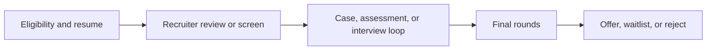

# Product Management Internship Recruiting for Summer 2027

## Executive summary

The highest-confidence conclusion from the current public record is that **PM internship recruiting at top-tier tech companies has become both narrower and more technical** between 2024 and 2026. Among the companies you named, I found clear public evidence of active or very recent PM/APM internship-style recruiting at **Google, Microsoft, Atlassian, Snowflake, and Databricks**. **Meta’s RPM is active, but the public program is an 18-month rotational full-time role rather than a summer internship.** For **Stripe, Airbnb, Linear, Figma, Notion, Uber, DoorDash, and Coinbase**, I did not find a clearly public, accessible PM internship posting in the most recent cycle during this research pass; in several cases, careers pages showed internships in other functions and/or full-time PM roles, but not PM internships. That does not prove those companies never hire PM interns, but it does mean the **publicly visible supply of FAANG-tier PM internships is thinner than many students assume**. citeturn9view0turn15view0turn24view0turn35search0turn38view0turn13search1turn4search0turn20search4turn32view0turn31view0turn29search2turn39search1turn39search2

The second big shift is that **“I built something” now means much more than “I coded a demo.”** The companies with active PM-intern-style roles are explicitly screening for customer interviews, success criteria, telemetry, competitive analysis, SQL/Python or adjacent technical fluency, and the ability to reason about AI-enabled products. Microsoft’s PM intern posting explicitly calls out OKRs, performance metrics, telemetry, and familiarity with AI/ML concepts in Copilot or agent-based systems; Databricks asks for a CS or related engineering background plus SQL/Python and data-driven product analysis; Atlassian’s APM internship asks interns to conduct customer interviews, review technical specs, and surface market opportunities; Google’s APM intern posting prefers candidates with programming, data analysis, business modeling, and design exposure. In other words, **AI coding tools have made shipping cheaper, so the signal has shifted toward judgment, instrumentation, iteration, and technical-product fluency**. citeturn15view0turn38view0turn24view0turn9view0

For a sophomore who is a complete PM beginner today, a **realistic probability range of landing at least one FAANG-tier or similarly elite PM internship for summer 2027 is roughly 2%–10%**, with **medium-low confidence** because public denominators are scarce and many firms no longer expose all PM-intern hiring publicly. That range rises materially only if the candidate can, by the time applications open, show **one anchor shipped product with real users or a meaningful internal deployment, evidence of metrics and iteration, at least moderate technical fluency, and a sharply articulated product story**. Without that, the odds are much closer to the bottom of the range. citeturn7search17turn12view2turn9view0turn15view0turn24view0turn38view0

## Program map

### Programs with clear public PM internship or APM-style tracks

| Company | Program or closest equivalent | Most recent cycle open and close dates | Rising juniors eligible | Typical application-to-offer flow | Acceptance rate or volume | Degree / technical bar | Summer pay proxy | Sources |
|---|---|---|---|---|---|---|---|---|
| Google | Associate Product Manager Intern | **Most recent publicly cached U.S. posting:** opened **Oct 8, 2024** and closed **Oct 21, 2024** for Summer 2025. A strong secondary source reports **Sept 23-Oct 7, 2025** for Summer 2026. | **Yes, if junior year is your penultimate year.** Google’s U.S. posting said the internship is intended for students entering their **penultimate year** and returning to school after the internship. | Usually **resume review → recruiter screen → product/analytical interviews**; commonly reported total cycle is **about 2-3 months**. Publicly accessible reports do **not** consistently show a separate OA. | Not publicly disclosed. A current Google APM publicly describes the program as **“<1% acceptance rate”**; treat that as directional, not audited. | **Technical leaning.** Google’s posting listed Product Management, CS, Engineering, Data Science, Math, Stats, or related technical fields, and preferred programming/data analysis/design/business-modeling exposure. | Official 2025 U.S. posting listed **$90,000-$106,000 annualized base**, roughly **$43-$51/hr equivalent** before any internship adjustments. | citeturn9view0turn9view2turn7search17turn8search1 |
| Meta | Rotational Product Manager | **Aug 27-Sep 10, 2024** for the public 2025 RPM application window. **Important:** this is the public **full-time RPM**, not a summer internship. | **No** for rising juniors in the public RPM program; it is a rotational full-time early-career role rather than a penultimate-year internship. | **Application → recruiter review → interviews**; Meta RPM leader said applications are reviewed on a **rolling basis** and **all applications are reviewed by recruiters**. Candidate timelines in the 2026 thread show about **2 weeks** from application to first response for early applicants. | Not publicly disclosed. No credible public denominator found. | **Major-agnostic in principle.** Meta RPM leadership states candidates can come from **technical and non-technical backgrounds** and prior PM experience is **not required**. | Not comparable to internship pay. Public Levels data shows a **median U.S. RPM full-time package of about $171,746**. | citeturn12view2turn12view3turn13search1turn11search9 |
| Microsoft | Product Manager Intern | **Posted Jan 9, 2026** for Vancouver Summer 2026 and listed as **open for a minimum of 5 days, then rolling until filled**. Other public mirrors for recent cycles show close dates such as **Jan 31, 2025** and **Sep 8, 2025**, but Microsoft often processes PM intern roles on an ongoing basis. | **Yes.** Microsoft requires that you be pursuing a bachelor’s or master’s degree and have **at least one semester or term remaining** after the internship. | Usually **application → recruiter contact → final/superday-style interviews**. Exponent’s 2026 guide says Microsoft PM intern processes are often **6-8 weeks** overall, with a **single-day multi-interview superday** late in the process. OA is **not a standard, universally reported** step for PM intern. | Not publicly disclosed. | **Technical bar is up.** Public job copies ask for **CS, Engineering, or related fields**, and recent PM intern postings explicitly prefer familiarity with **AI/ML concepts** in **Copilot / agent-based systems**. | Official recent postings show roughly **$5,460-$10,680/month** in many U.S. locations, with **$7,040-$11,640/month** in SF/NYC ranges; Vancouver posting did not show pay in the accessible copy. | citeturn15view0turn18view1turn18view2turn14search5turn17search13 |
| Atlassian | Associate Product Management Intern | For the Australia/New Zealand cycle, Atlassian’s recruiting materials say **February-June** recruiting; a recent public listing was posted **Feb 16, 2026**, and a public mirror showed **Apply by Apr 27, 2026**. | **Yes, if you are penultimate-year.** Atlassian explicitly says the program is open to **penultimate-year** university students. | **Rolling recruiting**; exact timeline varies by region. Public candidate discussion suggests recruiter/manager/values stages, with quick decisions after finals possible, but the high-confidence fact is that Atlassian recruits **on a rolling basis**. | No public acceptance rate. A recent LinkedIn listing showed **200+ applicants** after about a month, but cohort size is undisclosed. | **Not CS-only, but product-technical fluency matters.** Atlassian asks for customer interviews, market/product analysis, and **reviewing technical specs**. | No reliable public comp figure found for the most recent APM intern posting in accessible sources. | citeturn24view0turn24view1turn28search2turn28search12turn25search4 |
| Snowflake | Product Management Intern | Public job-board mirrors show the role was **posted by Feb 26, 2026** and still visible in early April 2026. I did **not** find a publicly cached exact close date. | **Unclear from accessible public caches.** Snowflake clearly runs university internships, but I did not recover a cached class-year field for the PM intern specifically. | Exact PM-interview flow was not publicly documented in accessible sources. High-confidence minimum is **resume screening plus interviews**, because Snowflake publicly operates a formal University Recruiting program. | Not publicly disclosed. | The PM intern role exists publicly and compensation is employer-provided on job boards, but the accessible cache did not preserve a full qualifications block; treat class-year/degree specifics as **unverified** in this pass. | Employer-provided public job-board copies place the role around **$60-$70/hr**. | citeturn33search0turn34search2turn35search3turn35search6turn35search13 |
| Databricks | Product Management Intern | The accessible public mirror for Summer 2026 shows the role had been **removed on Dec 9, 2025**; I did not recover a public exact open date. Recent PM-intern-related postings and mirrors confirm the program was active for Summer 2026. | Likely **yes for current undergrads**, but Databricks’ most accessible PM intern copy specifically asked for students **pursuing a degree in computer science or a related engineering subject**; it did not publicly cache a “rising junior” line. | Databricks publicly describes its hiring flow as **applying online → talent acquisition → skill assessments → interviewing → reference checks → decision and offer**. | Not publicly disclosed. | **High technical bar.** The accessible PM intern copy asked for **CS or related engineering**, plus some **SQL/Python** and data-driven product reasoning. | Built In’s cached job copy shows **$54-$56/hr** in SF Bay Area and **$51.50-$53.50/hr** in Bellevue; Levels self-reports show **about $52/hr** for Summer 2025 PM interns. | citeturn38view0turn33search10turn36search3turn36search5 |

### Companies where I did not find a clearly public PM internship posting in the most recent accessible cycle

| Company | What I found instead | What that likely means for summer 2027 applicants | Source |
|---|---|---|---|
| Stripe | Stripe’s university page says internships are concentrated in engineering, ML, data science, and some business teams. In the accessible public search results, I did **not** find a Stripe PM intern posting. | **Do not assume a public PM internship exists each cycle.** Treat Stripe as a networking-heavy, low-visibility target unless a PM intern posting appears. | citeturn4search0turn4search1turn4search10 |
| Airbnb | Airbnb has active internships, but the accessible public archive showed other internships and not a dedicated PM internship. Airbnb explicitly frames internships as a conversion channel where possible. | Public PM internship supply appears **unclear to absent** in the accessible public record; internship-to-full-time intent remains important. | citeturn20search0turn20search4turn21search0turn20search6 |
| Linear | Current careers page showed only a **full-time Product Manager** role, with no internship track. | For Linear, the realistic path is more likely **exceptional direct outreach, a work-trial-style process, or later-career PM hiring**, not a predictable campus PM internship funnel. | citeturn32view0 |
| Figma | Current careers page listed many openings, including full-time PM roles, but I did **not** find a PM internship in the current openings. | PM internship appears **publicly absent in the current cycle**. | citeturn31view0 |
| Notion | Current careers page showed **Software Engineer Intern (Fall 2026)** plus a **full-time Product Manager, Enterprise** role, but no PM intern. | PM internship appears **publicly absent in the current cycle**. | citeturn29search2 |
| Uber | In the accessible public results, I found university/internship infrastructure roles but did **not** recover a public PM internship posting. | Treat Uber PM internship availability as **unverified / not found publicly in this pass**. | citeturn39search0 |
| DoorDash | DoorDash has a university careers page and active intern hiring, but the accessible job search did **not** surface a PM internship in the current intern & entry-level listings. | Public PM internship availability appears **unclear to absent** in the accessible record. | citeturn39search1turn39search5 |
| Coinbase | Coinbase’s careers pages show internships as a category and full-time PM roles, but I did **not** recover a public PM internship listing in the accessible current openings. | PM internship appears **publicly absent or at least not easily accessible** in the current cycle. | citeturn39search2turn39search3 |

A useful way to visualize the current market is that the 2027 applicant is not really competing for “PM internships at every top company.” They are competing for a **small number of visible, structured PM pipelines** plus a larger set of **low-visibility, less predictable opportunities**. citeturn9view0turn15view0turn24view0turn35search0turn38view0turn39search1turn39search2

Across the active programs, there is **no single universal OA** the way there often is in SWE recruiting. The more common pattern is a **resume-heavy first filter**, then either a recruiter conversation or direct interviews, followed by product, analytical, and behavioral loops. Databricks is one of the few companies in this set that publicly describes a general “skill assessments” stage in its hiring flow. citeturn9view2turn12view2turn14search5turn33search10

## What materially changed in PM internship recruiting from 2024 to 2026

The biggest structural change is **supply compression**. Public PM internship demand remains huge, but publicly visible openings among top-tier companies are concentrated in a much smaller set of firms than students often believe. Atlassian, Microsoft, Google, Snowflake, and Databricks show clear PM or APM intern-style pathways. Meta’s public RPM is a full-time rotational role. Many admired product-led companies on your list currently show **either no PM internship publicly, or only full-time PM roles**, which shifts competition toward fewer formal funnels and more off-cycle networking or adjacent-role strategies. citeturn24view0turn15view0turn9view0turn35search0turn38view0turn13search1turn4search0turn21search0turn32view0turn31view0turn29search2turn39search5turn39search2

The **technical-fluency bar has visibly moved up**. Google’s APM intern posting targets students in PM, CS, engineering, data science, math, statistics, or related technical fields, and prefers programming/time-in-technical environments. Microsoft’s PM intern postings ask for CS or engineering backgrounds and explicitly mention **AI/ML concepts, Copilot, and agent-based systems**. Databricks wants CS/engineering plus SQL/Python. Atlassian’s APM internship expects interns to review **technical specs**. This does **not** mean every PM intern must be a software engineer. It does mean that in 2026, top-tier PM internships are much less receptive to candidates who are purely “business generalists” with no technical or analytical depth. citeturn9view0turn15view0turn38view0turn24view0

AI tools have also changed **what counts as differentiated evidence**. Figma’s careers page explicitly links to a company essay called “Why are we so afraid of code as a commodity?” and emphasizes that product teams should focus on the **right problem**, not merely shipping something. Linear’s hiring philosophy centers on **ship early**, **build with users**, and **avoid side quests**. In practice, that means a candidate is less differentiated by “I can produce an app” and more differentiated by showing **why this problem mattered, whom they talked to, what metric moved, what constraints they discovered, and what they cut from scope**. citeturn31view0turn32view0

Referrals appear **less uniformly decisive than they used to be** in some structured programs, but not uniformly less important overall. The strongest explicit evidence is Meta RPM: the RPM leader publicly states that the program **does not take referrals** and that applications are reviewed by recruiters on a rolling basis. That is a meaningful contrast with the old student belief that PM pipelines are mostly referral-gated. At the same time, for companies where no structured public PM internship is visible, warm introductions and narrative-rich outreach likely matter **more**, because there is no clean formal application funnel to rely on. That second point is an inference from market structure, not an explicit company statement. citeturn12view2turn4search0turn21search0turn32view0turn31view0turn29search2

The public evidence on **return-offer rates** is thinner than I would like, but the directional signal is clear: internships are still being treated as **conversion pipelines**. Airbnb says that, where possible, its goal is to see interns join full-time, though conversion depends on performance and business need. Atlassian explicitly markets its APM internship as a path that gives students a close look at becoming full-time APMs. Snowflake’s university recruiting materials prominently feature intern-to-full-time stories. The implication is that when headcount tightens, the **external-entry PM market can shrink faster than the internship market**, because internships still serve as a pre-converted talent pipeline. citeturn20search0turn24view1turn33search0

## Where strong candidates get rejected and what accepted candidates do instead

The table below is a **cross-program synthesis** from recruiter-facing program guidance, public PM-intern/APM job descriptions, and recent candidate timelines. In a few places, I make a clearly marked inference from what the job descriptions say companies expect.

| Funnel stage | Common rejection pattern | What stronger candidates do instead | Evidence base |
|---|---|---|---|
| Resume and eligibility screen | They are **outside the explicit eligibility window**: not penultimate year for Google/Atlassian, or not returning to school after the internship. | They map their graduation date carefully and apply only where their class year matches the program. | citeturn9view0turn24view0turn24view1turn15view0 |
| Resume and eligibility screen | The resume says “built an app” or “led a team,” but gives **no proof of customer problem, metrics, or decision ownership**. | They write bullets that show a real product loop: **who the user was, what they learned, what they shipped, and what changed**. | citeturn12view2turn9view2turn38view0 |
| Resume and eligibility screen | The portfolio is polished, but there is **no evidence of technical or analytical fluency**. In 2026, that is much riskier than it was a few years ago. | They show enough technical depth to work credibly with engineers: SQL/Python basics, telemetry thinking, or structured reasoning about technical constraints. | citeturn15view0turn38view0turn9view0turn24view0 |
| Resume and eligibility screen | The application lacks evidence of **cross-functional collaboration, entrepreneurial initiative, or ambiguity-handling**. | They foreground founder/club/internship examples where they aligned people, made tradeoffs, and moved a project through uncertainty. | citeturn12view2turn9view0turn9view2 |
| Recruiter screen | They cannot clearly answer **“Why PM?”** or **“Why this company?”** without sounding generic. | They use one or two specific stories and connect them directly to the company’s product style and users. | citeturn9view2turn12view2turn32view0turn31view0 |
| Recruiter screen | They describe experience in **framework language** only, without a concrete product story. | They explain one actual decision: the user pain, the tradeoff, the launch choice, and the result. | citeturn12view2turn9view2 |
| Recruiter screen | They sound like they want “strategy” but not the messy work of telemetry, iteration, and stakeholder management. | They show that they know PM includes execution detail, not just ideas. | citeturn15view0turn38view0turn24view0 |
| Case or assessment | **Inference:** they can name a success metric, but they cannot name a **guardrail**, failure mode, or telemetry plan. This is a common weak spot because Microsoft and Databricks explicitly expect OKRs, success criteria, and telemetry thinking. | Stronger candidates define a north-star metric **and** at least one guardrail, instrumentation plan, and decision threshold. | citeturn15view0turn38view0 |
| Case or assessment | They ignore technical feasibility and speak as if engineering constraints do not exist. | They show “lightweight technical empathy”: dependencies, API/data constraints, launch sequencing, and why some scope gets cut. | citeturn24view0turn38view0turn15view0 |
| Case or assessment | Their AI idea is generic: “add a chatbot,” “add Copilot,” or “use AI for recommendations,” with no workflow, safety, or quality logic. | They ground AI features in a specific user workflow and define what “better” means operationally. | citeturn15view0turn38view0turn31view0 |
| Final rounds | They show customer empathy but weak prioritization, or prioritization but weak customer empathy. | They can move back and forth between **user pain, company goals, technical constraints, and metrics** without losing structure. | citeturn24view0turn15view0turn38view0turn9view2 |
| Final rounds | They sound polished but low-agency: lots of recommendations, little evidence of actually driving outcomes. | They can point to one thing they personally pushed over the line, including rough edges and tradeoffs. | citeturn12view2turn32view0 |
| Final rounds | They overbuild in their answers, as if every problem deserves a massive solution. | They scope aggressively and say what **not** to build yet. That matches how strong product organizations talk internally. | citeturn32view0turn31view0 |

The single most useful synthesis for a sophomore is this: **strong candidates sound like they have been inside the mess of building a product, not just studying PM content.** They talk concretely about users, edge cases, instrumentation, technical tradeoffs, and what they cut. Weak candidates usually sound one layer too abstract. citeturn12view2turn9view2turn15view0turn38view0turn24view0

## What portfolio work actually moves the needle now

### What the current bar for “I built something” actually is

The current bar is **not** “I used Cursor or Claude Code to assemble a CRUD app in a weekend.” The current bar is closer to: **I identified a real user problem, scoped a narrow solution, shipped it, measured usage or failure, and changed the product based on what I learned.** That interpretation is strongly aligned with how current top companies describe PM intern work: Atlassian emphasizes customer and partner interviews, technical-spec review, and competitive analysis; Microsoft emphasizes OKRs, telemetry, and customer needs; Databricks emphasizes SQL/Python, product-usage analysis, and solving ambiguous customer problems; Google prefers PM/software-development/technical experience plus programming, data, business, and design exposure. citeturn24view0turn15view0turn38view0turn9view0

A project now reads as **tutorial-level** when the artifact is the whole story: a nice landing page, a login flow, or an AI wrapper, but no evidence of user need, distribution, metrics, or iteration. It reads as **real product thinking** when the artifact is only one part of the story and the stronger signal is the **decision log** around it: why this user, why this scope, what you measured, what broke, and what changed next. Figma’s hiring language explicitly says the company focuses on solving **the right problem, not just shipping work**, and Linear’s hiring philosophy prioritizes **ship early**, **build with users**, and **avoid side quests**. That is the exact lens many PM interviewers now apply to student projects. citeturn31view0turn32view0

### How recruiters and hiring managers seem to evaluate portfolio work

The most credible public recruiter-facing guidance I found suggests that, for PM internships, recruiters first care about the **resume story**, not whether you have a visually elaborate portfolio. Google’s APM guide notes that the PM intern application puts most of the weight on the **resume** and transcript and does **not** require a cover letter; the resume needs to highlight product or project experience, leadership, entrepreneurial activity, and technical skills. Meta’s RPM leader tells applicants to demonstrate understanding of PM in business context, cross-functional collaboration, data-informed decision making, communication, stakeholder handling, and clarity of thought. That means the “click” decision is likely driven by whether the portfolio — if opened at all — reinforces those points quickly. citeturn9view2turn12view2

The practical difference between a portfolio that gets **30 seconds** and one that gets **3 minutes** is usually that the better one is **legible immediately**. The reviewer can scroll once and answer five questions: What problem did you choose? Who used it? What did you ship? What changed numerically or behaviorally? What did you learn and change? If those answers are buried behind aesthetics, jargon, or oversized PDFs, the portfolio is likely to be skimmed and abandoned. That is partly an inference, but it is tightly grounded in what these companies literally ask PM interns to do. citeturn12view2turn9view2turn15view0turn24view0turn38view0

### The three project archetypes that appear strongest for beginners

The strongest archetype is still **a real product with real users**, even if the user base is small. That aligns best with how modern PM internships are scoped: customer interviews, metrics, iteration, and ambiguity. The second-best archetype is **a deep teardown or PRD**, but only if it contains original insight, a credible success/guardrail metric set, and technical feasibility thinking. The third is **a data-driven product analysis or case study**, which works when it leads to a specific product recommendation and measurement plan rather than generic commentary. citeturn24view0turn15view0turn38view0turn31view0turn32view0

For **real products with users**, the strongest public examples I found were not “perfect PM-candidate portfolios” so much as strong proxies for the kind of work companies highlight. A public Google APM applicant explicitly pointed recruiters to a hackathon-built **album-cover generator** and a personal portfolio when applying. A recent Snowflake PM intern publicly described working in **agentic AI**, highlighting a product/problem framing around intelligent workflows and usable context, not just raw implementation. Atlassian’s own APM materials celebrate work like driving the **“insights”** feature in Jira Software and using data across products to help thousands of teams make decisions faster. Those examples all share the same structure: a defined problem, an identifiable user or workflow, and a claim about impact. citeturn9view3turn34search5turn20search1

For **deep teardowns or PRDs**, the public evidence is actually weaker than many students expect. I found far fewer recent accepted-candidate public posts saying “my teardown alone got me the internship” than posts or role descriptions centered on shipped work, technical reasoning, and user problems. That itself is informative. A teardown can still help, but it likely needs to look more like a **mini investment memo for a product org** than a classroom assignment: explicit user segmentation, measurable success criteria, guardrails, launch sequencing, risks, and non-obvious tradeoffs. Microsoft’s and Databricks’ PM intern expectations are especially clear on this point. citeturn15view0turn38view0

For **data-driven analyses**, the useful version is not “I collected some charts,” but “I used data to decide what to build, what not to build, and how to instrument the release.” DoorDash’s public internship project writeups — while written by software engineering interns — are revealing because the company spotlights work that connects system changes to user-facing effects such as reliability, observability, API usability, and partner outcomes. For PM candidates, the equivalent is a product analysis that ends in a prioritized recommendation with a telemetry plan. citeturn39search9turn39search11turn15view0turn38view0

### Realistic time investment

The best-supported answer is that the anchor project for a strong PM internship application is usually **not a weekend**, and often **not even just two weeks**. The evidence I found points toward **one meaningful project over 6-12 weeks** being much more credible than a pile of tiny artifacts. That is because the public role descriptions repeatedly expect customer interviews, tradeoff discussion, telemetry, iteration, and technical understanding — things that usually require multiple cycles, not just first launch. Atlassian’s own intern jobs are structured as twelve-week product-building experiences; DoorDash’s and Snowflake’s internship materials likewise highlight substantive work over a full program, not one-off demos. The right student analogy is **one anchor project plus one or two supporting artifacts**, not ten half-finished ideas. citeturn24view0turn39search9turn33search0

### What a total beginner should not do

There are at least five recurring anti-patterns that now look weak.

A **tutorial CRUD app with no users, no telemetry, and no reason to exist** is the clearest one. In 2026, that mostly signals access to tools, not product judgment. citeturn31view0turn32view0

A **portfolio of many small unfinished projects** is another. Linear’s explicit warning to **avoid side quests** maps almost perfectly onto this student failure mode. One finished thing that reached users is stronger than six conceptually interesting but abandoned repos. citeturn32view0

A **teardown that is really just a rephrased blog post** also performs poorly. If there is no original segmentation, metric design, or technical-feasibility reasoning, it does not show the product craft these programs now screen for. citeturn15view0turn38view0

An **AI wrapper with no workflow-level insight** is increasingly weak. The modern question is not “did you use AI?” but “what job-to-be-done became better, safer, faster, or cheaper — and how do you know?” citeturn15view0turn31view0turn34search5

Finally, **over-polishing before real use** is a major trap. Figma’s and Linear’s public hiring philosophies both push in the opposite direction: solve the right problem, ship early, learn, and avoid unnecessary detours. citeturn31view0turn32view0

## Confidence-rated assessment for a beginner sophomore

My estimate for a sophomore who is currently a **total beginner in PM** and is targeting **summer 2027** is:

| Outcome | Probability range | Confidence | Why |
|---|---|---|---|
| Landing at least one **public, FAANG-tier or equivalent** PM internship offer by summer 2027 | **2%-10%** | **Medium-low** | The public market is smaller than students assume, and many top companies either have no visible PM internship or run highly selective, technical-leaning funnels. citeturn9view0turn15view0turn24view0turn35search0turn38view0turn39search1turn39search2 |
| Landing one if the candidate builds a strong anchor project, becomes technically fluent enough for PM interviews, and applies broadly and early | **8%-20%** | **Low-medium** | This is an inference, but it matches what the active roles explicitly screen for: product plus technical plus analytical plus executional signal. citeturn9view0turn15view0turn24view0turn38view0turn12view2 |
| Landing one with **no** shipped work, **no** technical fluency, and only generic PM prep | **<1%-3%** | **Medium** | The active programs now screen too hard on evidence of product/technical judgment for a purely theoretical candidate to be competitive. citeturn9view0turn15view0turn38view0turn24view0 |

The **50th-percentile accepted candidate** in this market probably looks like this: one meaningful product or operations project with actual users or stakeholders; one strong technical or analytical signal such as SQL/Python, product analytics, or engineering-adjacent work; a class year that cleanly matches the program; and interview stories that sound like they came from real ambiguity rather than memorized PM frameworks. citeturn12view2turn15view0turn24view0turn38view0turn9view2

The **90th-percentile accepted candidate** looks meaningfully sharper: one anchor product with measurable retention/conversion/adoption evidence; stronger technical fluency; clearer cross-functional leadership; often some founder, intern, or builder experience in an environment where they had to make tradeoffs under uncertainty; and a convincingly opinionated understanding of where AI actually helps or hurts a workflow. citeturn15view0turn38view0turn31view0turn32view0turn12view2

For the beginner sophomore, the highest-ROI behavior starting **tomorrow** is not “learn more PM frameworks.” It is to choose **one user problem**, commit to one very small shipped version, put in basic instrumentation, talk to a handful of real users, and keep a short decision log. That behavior directly addresses almost every failure mode above: vagueness, lack of evidence, weak metrics thinking, and low-agency storytelling. citeturn32view0turn31view0turn15view0turn38view0

## Open questions and limitations

Some parts of this market remain unusually opaque. Exact open and close dates were often **not publicly cached** for smaller-company or rolling-cycle postings, and acceptance rates were **almost never publicly disclosed**. For several companies on your list — especially **Stripe, Airbnb, Linear, Figma, Notion, Uber, DoorDash, and Coinbase** — the strongest conclusion I can support is not “the program was cut,” but rather **“I did not find a public PM internship posting in the most recent accessible cycle.”** That distinction matters. citeturn4search0turn21search0turn32view0turn31view0turn29search2turn39search1turn39search2

The public evidence base is also much stronger on **program structure and role expectations** than on **first-person accepted-candidate portfolio postmortems**. Where I made inferences — especially about how recruiters react to specific portfolio choices or how AI tools changed standards — I grounded those in company job descriptions, recruiter-facing application guidance, and product-team operating principles, but they should still be read as **well-supported inference**, not audited internal policy. citeturn12view2turn9view2turn15view0turn24view0turn31view0turn32view0

### Sources list

Primary and near-primary program sources used in this report included Google’s cached APM intern posting and APM program materials, Meta RPM program materials and RPM leadership guidance, Microsoft students pages and PM intern job mirrors, Atlassian early-careers and APM internship pages, Snowflake university recruiting pages and employer-provided job-board copies, Databricks hiring-process materials and PM intern job mirror, Airbnb internship pages, Linear careers, Figma careers, Notion careers, DoorDash university careers, and Coinbase careers. Key secondary sources used sparingly for inaccessible or rolling postings included APM List, Exponent, Levels, Built In, Prosple, LinkedIn public job and post caches, and public Reddit timeline threads. citeturn9view0turn9view2turn12view2turn15view0turn17search13turn24view0turn28search2turn33search0turn38view0turn20search0turn32view0turn31view0turn29search2turn39search1turn39search2