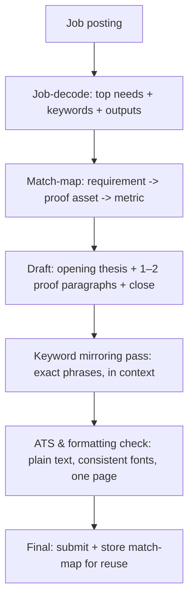

# Internship Cover Letters for College Students

## Executive summary

This report synthesizes evidence-based guidance on internship cover letters from major university career centers—especially entity["organization","Purdue Center for Career Opportunities","career center west lafayette, in, us"], entity["organization","Harvard Mignone Center for Career Success","career center cambridge, ma, us"], entity["organization","MIT Career Advising & Professional Development","career center cambridge, ma, us"], and entity["organization","Yale Office of Career Strategy","career center new haven, ct, us"]—plus writing/formatting guidance from entity["organization","Purdue OWL","writing lab purdue university"] and research/narrative guidance from entity["organization","MIT Communication Lab","career writing guidance mit"]. Where informative, it also incorporates hiring research and surveys (with limitations noted) and ATS-focused guidance from entity["organization","University of Virginia Career Center","career center charlottesville, va, us"] and entity["organization","Georgia Tech Career Center","career center atlanta, ga, us"]. citeturn3view1turn3view2turn3view3turn3view5turn7view0turn10view0turn10view1turn6view0turn14view1

Your school/major are unspecified, so this report assumes a typical U.S. college student applying to internships across common fields (tech/product, marketing/communications, and research/analytics) and focuses on broadly transferable best practices. citeturn3view2turn3view3turn6view0

Across top career-center sources, a great internship cover letter is best understood as a short, tailored argument that “ties” your resume (who you are) to the job posting (what the organization needs), using a small number of proof-based examples and company-specific motivation. citeturn3view1turn3view0turn6view0turn3view3

A recurring theme is that the cover letter is not a resume recap: strong letters complement the resume by adding selective detail, narrative logic, and fit—ideally in 3–4 tight paragraphs and no more than one page. citeturn3view2turn6view0turn3view5turn3view3turn7view0

Evidence on whether cover letters are always read is mixed: some surveys report high read rates and meaningful influence on interview decisions, while other polls show a sizeable share of hiring managers don’t read them consistently. The most defensible strategy is to assume variability by employer/role and still write a strong letter when it is requested, when it meaningfully adds information beyond your resume (fit, motivation, pivot explanation, or a writing sample), or when an ATS/hiring team may scan it for keywords and evidence. citeturn15view0turn15view1turn10view0turn6view0

## Purpose of internship cover letters

Career centers converge on three primary functions for student internship cover letters.

First, a cover letter serves as the bridge between a resume and a specific job posting: Purdue’s career-center framing is explicit that your resume represents who you are while a job posting represents the company’s needs, and the cover letter ties them together by showing how you will apply your experience, skills, and abilities to that role. citeturn3view1

Second, it is a screening artifact and writing sample. Harvard’s career-center materials state that the cover letter is a writing sample and part of the screening process; writing well and tailoring to the organization can increase the chances of an interview. citeturn6view0turn14view1

Third, it is an evidence-based “fit narrative” that must be tailored. Yale’s career-center guidance emphasizes that each letter should be tailored to a specific job, should connect your interest and qualifications, and should use confident language, active voice, and a one-page limit. citeturn3view3

A practical implication for internship applicants is that your cover letter should do what your resume often cannot do efficiently in bullets: (a) show why you want *this* role and *this* organization, (b) select the 1–3 most relevant capabilities, and (c) prove them with compact stories that clarify how you will contribute. citeturn3view2turn3view3turn14view2turn7view0

## Ideal structure, length, and format

Most top sources recommend a one-page business-letter format, with a clear opening purpose, a small number of evidence paragraphs, and a direct close.

MIT’s career-center guidance is explicit about baseline constraints: keep the cover letter no longer than one page, use 10–12 point font, include contact information, and address it to the hiring manager (by name when possible; otherwise “Dear Hiring Manager”). citeturn3view2 Purdue’s career-center guidance similarly recommends a standard professional letter format, the same font/header as your resume, and a one-page limit. citeturn3view1turn3view0

On paragraph structure, Purdue OWL recommends one introductory paragraph, one to three skill/highlight paragraphs, and one concluding paragraph—consistent with MIT’s “introduction + 2–3 body paragraphs + closing” model. citeturn3view5turn3view2

On formatting mechanics, Purdue OWL also provides practical layout guidance (single spacing, consistent margins, left alignment, and whitespace between paragraphs). citeturn3view5turn7view3 These “scan constraints” matter because hiring teams are often triaging quickly across application materials, making clarity and hierarchy more valuable than ornate formatting. citeturn10view2turn6view0

image_group{"layout":"carousel","aspect_ratio":"16:9","query":["block format cover letter example layout","modified block format cover letter example layout","one page cover letter formatting example business letter"],"num_per_query":1}

A minimal, ATS-safe layout skeleton (copy/paste-friendly) looks like this (adaptable to block or modified-block format). citeturn3view5turn7view3turn3view0turn3view2turn6view0

```text
First Last
City, State | phone | email | LinkedIn/Portfolio (optional)

Date

Hiring Manager Name
Title (if known)
Company
Company Address (optional if email/ATS)

Dear [Name] / Dear Hiring Manager:

Opening (2–4 sentences): role + why this company/team + your 2–3-skill “thesis.”

Body paragraph 1 (4–6 sentences): Skill #1 → evidence story → result/impact → relevance to role.

Body paragraph 2 (4–6 sentences): Skill #2 → evidence story → result/impact → relevance to role.
(optional: Body paragraph 3 if truly needed and still <1 page)

Closing (2–4 sentences): enthusiasm, next steps, thanks, contact info.

Sincerely,
[Name]
```

Two high-leverage “internship-specific” format details show up repeatedly in top guidance: address the letter to a person if possible, and ensure your cover letter matches your resume visually (font and header) so the packet reads as one coherent application. citeturn3view0turn3view1turn6view0turn14view1

## Tailoring workflow built around job-decode, match-map, and keyword mirroring

Tailoring is not an aesthetic preference; major career centers describe it as a functional requirement. Purdue’s cover-letter breakdown explicitly recommends using keywords from the job description and expanding on experiences that prove you are a match. citeturn3view0turn3view1 Yale’s framework likewise tells applicants to use keywords from the position description and to make each letter tailored to a specific job. citeturn3view3 Harvard’s career-center guidance adds that a strong approach is to highlight skills/experiences most applicable to the job and tailor to the specific organization; it also explicitly instructs applicants to reference skills/experiences from the job description and connect them to their credentials. citeturn14view1turn6view0turn17view0

A rigorous tailoring workflow can be operationalized into three discrete artifacts: (1) job-decode notes, (2) a match-map, and (3) keyword mirroring choices (in-context, not stuffed). citeturn7view4turn3view0turn3view3turn10view2turn10view1 fileciteturn0file0

### Job-decode

Job-decode means turning a posting into a prioritized list of needs. MIT Sloan’s cover letter packet explicitly instructs applicants to carefully read the job description for the skills and experiences the company is looking for, then research the company and role context. citeturn7view4turn6view1

A practical job-decode output is:
- “Top 3 must-prove capabilities” (repeated or emphasized requirements)
- “Core outputs” (what you will ship/do weekly)
- “Language to mirror” (exact terms for skills/tools/competencies the posting uses) citeturn3view0turn3view3turn10view0turn10view1

### Match-map

Match-mapping is the bridge between job requirements and your evidence. Yale’s framework encourages you to start each middle paragraph with a skill aligned to the position and then provide examples that demonstrate that skill, rather than restating the resume. citeturn3view3 MIT’s career-center guidance similarly recommends citing a couple of experience examples that support your ability to succeed, complementing—not repeating—your resume. citeturn3view2

The match-map format below is designed to fit on one page and can be reused across applications.

**Reusable one-page match-map table format** citeturn3view0turn3view3turn3view2turn7view0turn10view0

| Job requirement (verbatim) | Priority | Keywords to mirror (exact) | Your proof asset | Proof story notes (Action → Scope → Result) | Metrics or “scope signals” | Where it will appear |
|---|---:|---|---|---|---|---|
| [Requirement #1] | High | [KW1, KW2] | [Project / class / job / org] | [What you did + how + why it mattered] | [#, %, time, audience] | [Body ¶1] |
| [Requirement #2] | High | [KW3, KW4] | [Project / class / job / org] | [Action → scope → result] | [metric] | [Body ¶2] |
| [Requirement #3] | Med | [KW5] | [Project / class / org] | [Action → scope → result] | [metric/scope] | [Opening thesis or ¶2] |
| [Nice-to-have] | Low | [KW6] | [Any credible evidence] | [Optional] | [optional] | [Optional sentence] |
| Company “why” trigger | High | [Product/mission terms] | [Research + connection] | [Why this org/team now] | [specific detail] | [Opening + Closing] |

### Keyword mirroring without stuffing

Several sources make the same point in different language: use the posting’s keywords, but do it naturally and credibly.

Yale explicitly recommends using keywords from the position description in the cover letter. citeturn3view3 Purdue recommends using keywords from the job description where possible. citeturn3view0turn3view1 Harvard adds that referencing skills/experiences from the job description and drawing connections to your credentials is part of effective letter-writing. citeturn6view0turn14view1

On the “don’t stuff” side, the 2018 eye-tracking study from entity["company","TheLadders","job search platform us"] warns that keyword stuffing is associated with poor readability and reinforces that keywords should be presented in context because a successful application must ultimately be read by a real person. citeturn10view2turn2search0

An ATS-specific nuance is that cover letters may be scanned too. UVA’s career-center guidance explicitly states that a cover letter may be scanned for keywords and skills, reinforcing the practicality of mirroring job language in a readable way. citeturn10view0



## Crafting proof-based stories that are short, credible, and quantified

Top guidance is consistent that your body paragraphs should be evidence-based, not declarative.

MIT’s career-center model for the body is to cite a couple of examples from your experience supporting your ability to succeed, and to “try not to simply repeat your resume in paragraph form,” instead adding detail and explicitly connecting skills to the target role. citeturn3view2 Harvard similarly emphasizes giving examples supporting your skills/qualifications and avoiding reiterating your entire resume. citeturn6view0turn14view1

The most operational “proof” instruction appears in MIT Communication Lab guidance: back up claims with concrete accomplishments and, if possible, quantify them; use scope and outcomes to show qualifications rather than simply asserting them. citeturn7view0turn7view2

### The action–scope–result–metric micro-template

A compact proof story (2–4 sentences) can follow this template, designed to satisfy “show, don’t tell” while staying readable:

**Skill claim (topic sentence)**: “I’ve developed [skill] through [context], which maps to [job need].”  
**Action + method**: “In [project/role], I [did X] using [tools/process].”  
**Scope + constraints**: “I worked with [team size/stakeholders] on [timeframe/scale].”  
**Result + metric**: “This led to [outcome], improving [metric] by [number] / enabling [impact].”

This aligns with MIT’s “examples + connect back to role” guidance and Harvard’s “examples + reader’s needs” framing. citeturn3view2turn6view0turn14view1

### What counts as a “metric” for students

Even if you haven’t held a formal internship yet, you can often quantify (or at least “scope-signal”) outcomes. MIT Communication Lab’s “quantify if possible” guidance is compatible with student contexts where metrics may be approximate, process-based, or adoption-based. citeturn7view0turn7view2

Common student-friendly metrics include:
- volume (e.g., number of users, respondents, posts, analyses, data rows),
- time (e.g., hours saved per week, turnaround time),
- quality (e.g., error reduction, rubric scores, accuracy),
- growth/adoption (e.g., engagement rate increases, event attendance),
- throughput (e.g., deliverables shipped per sprint/week). citeturn7view2turn14view1turn10view0

### How to keep proof readable

A consistent caution across sources is that your letter must remain concise and skimmable. Harvard explicitly says to keep letters concise and factual (no more than a single page) and avoid flowery language. citeturn6view0turn14view1 MIT Communication Lab similarly warns that if examples become too long, they may not get read. citeturn7view2

Practically, this means your strongest “proof density” comes from choosing fewer stories and making each story do more work: one story can demonstrate multiple job needs if written intentionally (e.g., an analytics project can demonstrate technical skill, stakeholder communication, and results orientation). citeturn3view2turn7view0turn3view3

## Handling limited experience and pivoting between fields

A common student concern is “I don’t have relevant experience yet.” The best sources do not interpret this as disqualifying; they treat it as a framing problem.

Purdue’s career-center breakdown explicitly encourages students to point out relevant skills developed through coursework and experiences and to describe how they would apply those skills to the position. citeturn3view0 MIT’s career-center guidance addresses this directly: if you are seeking a position in a field without an obvious parallel to your academic training, be explicit about why you want the field/role and what value you bring (e.g., highlighting quantitative skills and problem-solving if pivoting from engineering to finance/consulting). citeturn3view2

This implies a student-appropriate evidence hierarchy:
- course projects, labs, and capstones,
- student org leadership and outcomes,
- part-time jobs framed as transferable skill proof,
- research assistantships and independent study outputs. citeturn3view0turn3view2turn3view3turn14view2

Two tone pitfalls are repeatedly flagged for limited-experience applicants.

The first is “apology language” (“Although I don’t have experience…”). Instead, top guidance pushes you toward positive, needs-focused language and active voice. citeturn3view3turn3view1turn6view0

The second is overclaiming. MIT Communication Lab suggests adopting a conversation-starting posture (“I’m excited to explore…”) rather than asserting perfect fit, while still anchoring claims in proof. citeturn7view0turn7view2

## Templates, annotated samples, ATS considerations, and pre-submit tools

### Fill-in template table

This template combines the most consistent “must include” elements across major career-center models: role + interest + thesis; 1–2 evidence paragraphs; tight close; one-page business-letter formatting; and explicit job-language connection. citeturn3view0turn3view2turn3view3turn6view0turn7view3turn14view1turn7view0

| Letter block | Fill-in text | Tailoring knobs (job-decode inputs) | Common mistakes to avoid |
|---|---|---|---|
| Subject line (email) | `Application: [Role Title] – [Your Name]` | Use the exact role title from posting | Vague subjects (“Internship Application”) |
| Header | `Name • City, ST • Phone • Email • Portfolio/LinkedIn` | Match resume header | Using document header/footer that may not parse well citeturn10view0 |
| Recipient line | `Hiring Manager Name, Title (if known)` | Find name via company site or entity["company","LinkedIn","professional social network"] when possible | Misspelling names; wrong person/company |
| Opening (2–4 sentences) | `I’m applying for [Role] at [Org/Team]. I’m a [year] studying [major—if relevant] (graduating [date]). I’m interested in [Org] because [specific, researched reason]. I would bring [Skill 1], [Skill 2], and [Skill 3] developed through [proof asset].` | Choose top 2–3 needs from job-decode and mirror exact phrasing | Generic “I’m excited to apply”; empty flattery; no thesis |
| Body paragraph 1 | `For [Skill 1], in [context] I [action] using [tools/process], working across [scope]. This resulted in [measurable outcome], which aligns with your need for [job language].` | Pick highest-priority requirement; map to strongest story | Rewriting resume bullets as prose; no outcome |
| Body paragraph 2 | `For [Skill 2], I [action]… leading to [result]. I’m excited to apply this to [specific team/output].` | Use second-highest requirement; include team/output language | Introducing new claims without proof; unclear relevance |
| Optional body paragraph 3 | Use only if needed for a required must-have | Only if still ≤1 page | Over-length letters that bury the point citeturn3view5turn3view2 |
| Closing (2–4 sentences) | `I’m energized by [specific organization/team detail]. Thank you for your time and consideration. I’d welcome the opportunity to discuss how I can contribute to [team]. I can be reached at [phone/email].` | Re-state “why here” and “how I help” | Passive close; no next step; overconfident tone |
| Format constraints | `≤ 1 page; 10–12 pt; business letter format; consistent font with resume` | Keep it scannable; clean formatting | Graphics/tables/text boxes; inconsistent fonts; dense blocks of text citeturn3view2turn7view3turn10view0 |

### Annotated sample letters

The three sample letters below are intentionally written for an unspecified student profile and use placeholder names/organizations. Each one demonstrates (a) job-decode → thesis, (b) match-map → two proof paragraphs, and (c) keyword mirroring → exact skill language integrated into evidence (not stuffed). citeturn3view2turn3view3turn7view0turn10view2

#### Sample A: Tech/Product internship

```text
Jordan Lee
Indianapolis, IN | (317) 555-0101 | jordan.lee@email.com | portfolio.link

March 3, 2026

Taylor Morgan
Product Manager
Riverstone Payments

Dear Taylor Morgan:

I’m writing to apply for the Product Intern role on Riverstone Payments’ Checkout Experience team. I’m a college student (major unspecified) seeking an internship where I can combine user-focused problem solving with data-informed decision-making. Riverstone’s focus on reducing checkout friction for small businesses is compelling to me, and I would bring (1) structured customer discovery, (2) basic product analytics, and (3) cross-functional execution experience from class projects and student leadership work.

In a recent semester-long product project, my team and I interviewed 12 student-customer “buyers,” mapped the end-to-end funnel, and translated the top pain points into a prioritized backlog. I wrote a lightweight PRD, defined success metrics (activation rate, drop-off points), and partnered with a designer and two developers to ship an MVP within three weeks. After launch, we used survey feedback and event tracking to iterate on the onboarding flow, improving completion from 52% to 71% across two test cohorts.

I’ve also practiced communicating tradeoffs clearly to stakeholders. As a committee lead for a campus organization, I coordinated timelines across marketing, finance, and operations for a 250-person event series. When we faced a venue constraint, I proposed three options with cost and impact tradeoffs, aligned the group on a decision in one meeting, and delivered the series under budget while increasing attendance by 18% compared with the prior term.

I’m excited about the chance to learn from Riverstone’s product team and contribute to customer-first experimentation and iteration. Thank you for your time and consideration—I’d welcome the opportunity to discuss how I can support the Checkout Experience team this summer.

Sincerely,
Jordan Lee
```

**Why this works (annotation table)** citeturn3view2turn7view0turn6view0turn3view1

| Paragraph | What it’s doing | Tailoring mechanics | Proof signals |
|---|---|---|---|
| Opening | Names team; states thesis with 3 skills | Job-decode → top skills; company-specific “why” | Clear fit hypothesis; non-generic motivation |
| Body 1 | Demonstrates discovery + PRD + metrics | Match-map requirement → story | Action, scope, results with % change |
| Body 2 | Adds execution + stakeholder tradeoffs | Match-map second requirement | Constraints → decision → impact |
| Close | Polite call to action | Reinforces “why here” + contribution | Professional tone |

#### Sample B: Marketing/Communications internship

```text
Jordan Lee
Indianapolis, IN | (317) 555-0101 | jordan.lee@email.com | writing-portfolio.link

March 3, 2026

Avery Chen
Communications Director
BrightSteps Youth Initiative

Dear Avery Chen:

I’m applying for the Marketing & Communications Intern position at BrightSteps Youth Initiative. I’m a college student (major unspecified) and I’m drawn to BrightSteps’ mission because it combines measurable community impact with storytelling that motivates action. I would bring strong writing and editing, basic content analytics, and campaign coordination experience developed through campus communications work and community volunteering.

In my campus role supporting a student organization newsletter, I planned a month-long content calendar, interviewed peers for short profiles, and edited contributor drafts into a consistent voice. I also tracked performance weekly and adjusted subject lines and posting times based on engagement patterns. Over six issues, average open rates increased from 31% to 44%, and click-through improved by 22% after we redesigned the “top story” section and tightened each issue’s call-to-action.

I’ve also learned to produce content quickly without sacrificing accuracy. During a volunteer fundraising drive, I wrote social posts, drafted donor thank-you emails, and worked with a small team to coordinate a one-week campaign across Instagram and email. We exceeded our target by $3,800 and grew our follower count by 14% through a consistent message framework and clear donation instructions.

BrightSteps’ emphasis on communicating outcomes—not just activities—matches how I like to work, and I’m excited about contributing to community-facing storytelling and campaign execution. Thank you for considering my application. I would welcome the opportunity to discuss how I can support your communications team this summer.

Sincerely,
Jordan Lee
```

**Why this works (annotation table)** citeturn3view3turn6view0turn14view1turn7view2

| Paragraph | What it’s doing | Tailoring mechanics | Proof signals |
|---|---|---|---|
| Opening | Mission alignment + 3-skill thesis | Company “why” is specific and impact-oriented | No fluff; clear “marketing tool” framing |
| Body 1 | Shows writing + analytics + iteration | Keyword mirroring (content calendar, engagement) | Quantified comms outcomes |
| Body 2 | Shows campaign coordination + results | Second match-map story | Fundraising and growth metrics |
| Close | Ends concise, confident | Reinforces fit and contribution | No overuse of “I”; professional close |

#### Sample C: Research/Analytics internship

```text
Jordan Lee
Indianapolis, IN | (317) 555-0101 | jordan.lee@email.com | github.link

March 3, 2026

Samira Patel
Research Manager
Midwest Policy Lab

Dear Samira Patel:

I’m writing to apply for the Research Analyst Intern role at Midwest Policy Lab. I’m a college student (major unspecified) seeking a summer position where I can contribute to rigorous, applied research that informs policy decisions. I’m particularly interested in your recent work on program evaluation and evidence-based interventions, and I would bring (1) structured literature review and synthesis, (2) quantitative analysis skills, and (3) clear research writing developed through coursework and project-based work.

In a recent methods-focused course project, I conducted a literature review on interventions to improve student attendance and translated findings into a short evidence brief with actionable recommendations. I built a simple data-cleaning workflow, documented assumptions, and produced visual summaries that made results easy to interpret for non-technical readers. My final brief was selected as a model example for the course because it combined clear claims with transparent methodology.

I’ve also practiced doing careful quantitative work with messy data. In an independent project, I analyzed a public dataset (200,000+ rows) to examine factors associated with program participation. I wrote reproducible code, validated results with sensitivity checks, and summarized the findings in a two-page memo that explained limitations and next steps. This experience would help me contribute to Midwest Policy Lab’s evaluation work with a disciplined, documentation-first approach.

Thank you for your time and consideration. I’m excited about the opportunity to support your team’s research and would welcome the chance to discuss how I can contribute this summer.

Sincerely,
Jordan Lee
```

**Why this works (annotation table)** citeturn3view2turn7view0turn14view1turn3view3

| Paragraph | What it’s doing | Tailoring mechanics | Proof signals |
|---|---|---|---|
| Opening | Specific research interest + capability thesis | Job-decode: program evaluation, applied research | Clear fit; not generic |
| Body 1 | Evidence brief example | Match-map: synthesis + writing | Scope, deliverable, reader focus |
| Body 2 | Quant analysis example | Match-map: quantitative + rigor | Scale signal, reproducibility, limitations |
| Close | Professional close | Reinforces intent | Clear next step |

### Tone, formatting, and ATS considerations

Tone guidance is surprisingly consistent across the best sources: confident, active-voice, and needs-focused rather than self-focused. Yale explicitly recommends confident language and active voice. citeturn3view3 Harvard recommends letters be concise and factual, avoid flowery language, and not overuse the pronoun “I.” citeturn6view0turn14view1turn17view0 MIT Communication Lab similarly recommends a professional, conversation-starting stance rather than overconfident claims. citeturn7view0turn7view2

For ATS: treat your cover letter as a document that may be parsed similarly to your resume. UVA explicitly notes that cover letters may be scanned for keywords and skills, which means your match-map keywords should appear in readable context in the letter (especially in the opening thesis and topic-sentence skill claims). citeturn10view0turn10view2 Georgia Tech’s ATS guidance reinforces the broader principle that extraneous formatting (headers/footers/tables/columns) can cause parsing problems and that keyword inclusion should not devolve into forced stuffing. citeturn10view1turn10view2

### Common mistakes and a quick pre-submit checklist

The mistakes below are directly supported by career-center writing guidance emphasizing tailoring, clarity, and error-free execution.

| Mistake | Why it hurts | Fix | Evidence |
|---|---|---|---|
| Generic letter that could be sent anywhere | Signals low effort; doesn’t show fit | Add one researched “why this org/team” line and mirror top job needs | citeturn3view1turn7view4turn14view1 |
| Resume rewritten as paragraphs | Adds no new information | Choose 1–2 stories; add detail, logic, and “so what” | citeturn3view2turn6view0turn3view3turn7view4 |
| Claims without evidence (“great communicator”) | Reads as unsupported | Use concrete accomplishments; quantify when possible | citeturn7view0turn7view2turn14view1 |
| Too long / dense | The best content won’t be read | One page; 3–4 paragraphs; tight topic sentences | citeturn3view2turn3view5turn3view3turn6view0 |
| Typos, wrong company name, misspelled recipient | Signals sloppiness | Slow proofread; read aloud; verify header + salutation | citeturn7view0turn6view0turn3view1turn3view0 |
| Keyword stuffing | Hurts readability; looks automated | Use keywords only where you have proof and keep them in context | citeturn10view2turn10view1turn3view3 |

A fast pre-submit checklist (60–120 seconds) can be framed as pass/fail:

| Check | Pass standard | Evidence |
|---|---|---|
| One-page constraint | ≤ 1 page; 10–12 pt; readable spacing | citeturn3view2turn3view5turn3view1 |
| Tailoring | Role + company named; at least one specific “why here” detail | citeturn3view1turn14view1turn7view4 |
| Proof | Each body paragraph contains one accomplishment story with outcome/scope | citeturn3view2turn7view0turn6view0 |
| Keyword mirroring | 3–6 critical job terms appear naturally in context | citeturn3view3turn10view0turn10view2 |
| Error-free | Names, titles, and dates accurate; no typos | citeturn7view0turn6view0 |
| Visual consistency | Same font/header as resume | citeturn3view1turn6view0turn14view1 |

### A short self-rubric for internship cover letters

This rubric is designed to be used quickly (2–4 minutes) and aligns directly to what top career centers emphasize: tailoring, proof, clarity, and professional mechanics. citeturn6view0turn3view2turn3view3turn7view0turn10view0

| Dimension | 5 (Excellent) | 3 (Adequate) | 1 (Needs work) |
|---|---|---|---|
| Tailoring specificity | Company/team specifics; clear role thesis; obvious match-map | Names role; limited “why here” | Generic; could be sent anywhere |
| Proof quality | 2 strong stories with outcomes/metrics/scope | 1 strong story; other paragraph weaker | Claims without evidence |
| Relevance | Most sentences map to job needs | Some relevant; some filler | Mostly filler |
| Structure/scan | 3–4 paragraphs; strong topic sentences; ≤1 page | Slightly long; topic sentences vague | Hard to skim; too long |
| Tone | Confident, active voice, needs-focused | Mostly professional; occasional apology/fluff | Overconfident, informal, or self-focused |
| Mechanics/ATS safety | Simple formatting; no odd symbols; keywords in context | Minor formatting risk | Complex formatting; keyword stuffing; errors |

### Time-saving workflow for batch internship applications

A recurring “rigor” insight across the best sources is that high-quality tailoring depends on preparation artifacts (job-decode notes and match-maps), not on rewriting from scratch every time. citeturn7view4turn3view0turn14view1turn10view0

A practical batch workflow divides work into setup, per-job tailoring, and final QA:

**Setup once (60–90 minutes for the season)**  
Create a “story bank” of 6–8 proof stories in action–scope–result form (projects, leadership, research, part-time work). Then create 2–3 base letter variants by job family (tech/product, marketing/comms, research/analytics), each with swappable thesis lines and paragraph shells. This aligns with the “tell a compelling story” and “don’t reiterate your resume” guidance from MIT Sloan and others. citeturn7view4turn6view1turn3view2turn3view1

**Per job (20–35 minutes once your system exists)**  
Job-decode (5–8 min) → match-map (5–8 min) → draft by assembling two stories (8–12 min) → keyword mirroring + proofread (5–7 min). This sequencing is directly compatible with career-center instructions to read the job description carefully, prioritize relevant skills, and tailor language to the posting. citeturn7view4turn3view0turn3view3turn10view0

**Optional AI acceleration (editing, not authorship)**  
Harvard’s guidance allows generative AI as an editing aid (brainstorm revisions, incorporate keywords from a job description) but warns that AI should not be the primary author because output becomes generic—exactly the opposite of what tailoring requires. citeturn17view0turn14view1

```mermaid
gantt
  title Drafting and revising one tailored internship cover letter (typical 25–40 minutes after setup)
  dateFormat  HH:mm
  axisFormat  %H:%M

  section Tailor
  Job-decode (needs + keywords)      :a1, 00:00, 00:08
  Match-map (req -> proof)          :a2, after a1, 00:08
  Assemble draft (thesis + 2 stories):a3, after a2, 00:12

  section Quality
  Keyword pass (in context)         :b1, after a3, 00:05
  Proofread + formatting check      :b2, after b1, 00:07
```



## Source URLs

```text
Purdue CCO – Discover the Purpose (Cover Letters):
https://www.cco.purdue.edu/Students/CoverLetters

Purdue CCO – Cover Letter Breakdown:
https://www.cco.purdue.edu/Students/CoverLetters?tab=CoverLetterBreakdown

Purdue OWL – Quick Formatting Tips for Cover Letters:
https://owl.purdue.edu/owl/job_search_writing/job_search_letters/cover_letters_1_quick_tips/quick_formatting_tips.html

Purdue OWL – Cover Letters Part 1 (formats, 1 page, margins, font match):
https://owl.purdue.edu/owl/job_search_writing/skilled_labor_job_search_resources/cover_letters/cover_letters_part_1.html

MIT CAPD – How to write an effective cover letter:
https://capd.mit.edu/resources/how-to-write-an-effective-cover-letter/

MIT Communication Lab (Broad Institute) – Cover letter for a job:
https://mitcommlab.mit.edu/broad/commkit/cover-letter-for-a-job/

Yale Office of Career Strategy – Cover Letters & Correspondence:
https://ocs.yale.edu/channels/cover-letters-correspondence/

Harvard Mignone Center for Career Success – Create a strong resume (includes cover letter guidance and sample):
https://careerservices.fas.harvard.edu/resources/create-a-strong-resume/

Harvard MCS – Create a Resume/CV or Cover Letter:
https://careerservices.fas.harvard.edu/channels/create-a-resume-cv-or-cover-letter/

Harvard (PDF) – HES Resumes & Cover Letters (includes “write an effective cover letter” page):
https://cdn-careerservices.fas.harvard.edu/wp-content/uploads/sites/161/2024/08/2024-HES_resume-and-letter.pdf

MIT Sloan Career Development Office (PDF) – Creating a Powerful Cover Letter:
https://cdn.cdo.mit.edu/wp-content/uploads/sites/67/2019/07/Cover-Letter-Sample-Packet-Revised-2017-2018.pdf

UVA Career Center – Navigating ATS (notes cover letters may be scanned for keywords):
https://career.virginia.edu/Students/Prepare/Resumes/NavigatingATS

Georgia Tech Career Center – Resumes, Cover Letters, & Portfolios (ATS discussion and formatting cautions):
https://career.gatech.edu/resumes/

TheLadders (PDF) – Eye-Tracking Study (2018):
https://www.theladders.com/static/images/basicSite/pdfs/TheLadders-EyeTracking-StudyC2.pdf

NACE – What employers look for on college students’ resumes (evidence-of-skill framing relevant to proof-based writing):
https://www.naceweb.org/talent-acquisition/candidate-selection/what-are-employers-looking-for-when-reviewing-college-students-resumes

Resume Genius – Cover letter statistics (survey; useful but not a university source):
https://resumegenius.com/blog/cover-letter-help/cover-letter-statistics

LinkedIn post polling hiring managers on cover letter reading (informative but not representative research):
https://www.linkedin.com/posts/joshbob_do-hiring-managers-actually-read-cover-letters-activity-7318980241673097216-AeQ2
```