# College Student Resume Best Practices for Internships and Entry-Level Roles

## Executive summary

This report synthesizes guidance from leading university career centers and employer research to identify what consistently works for **college students (undergraduates and recent grads)**: make the resume **easy to scan in seconds**, **ATS-parseable**, and packed with **evidence of skills** rather than claims. Key source anchors include entity["organization","Massachusetts Institute of Technology","university cambridge, ma, us"] career guidance, entity["organization","Stanford Career Education","career center stanford, ca, us"] resume frameworks, entity["organization","Purdue Center for Career Opportunities","career center west lafayette, in"] formatting and “bullet formula” guidance, entity["organization","University of Michigan Engineering Career Resource Center","career center ann arbor, mi"] ATS and “impact statement” examples, entity["organization","National Association of Colleges and Employers","college employer association us"] employer survey data, plus company-facing recruiting advice from entity["company","McKinsey & Company","management consulting firm"], entity["company","Microsoft","technology company"], and entity["company","Amazon","ecommerce and technology"]; occupational keyword/tool signals are grounded in entity["organization","O*NET OnLine","us labor occupation database"] job-posting and occupation data, and ATS formatting risks are reinforced by entity["organization","UIC Career Services","university career services chicago, il"] guidance and entity["company","TheLadders","job search platform"] eye-tracking research. citeturn19view0turn17view0turn23view0turn24view0turn25view0turn26view0turn14search7turn27view0turn28view0

The most consistent “college resume” best practices are:

- **One page, one column, standard headings, conservative fonts, and adequate white space**. Undergrad one-page guidance appears explicitly in Purdue’s student resume instructions and is echoed across other university guidance (with 2 pages being more typical for graduate/advanced candidates or unusually extensive experience). citeturn23view0turn19view0  
- **Write bullets as impact statements (CAR/PAR) and keep them short**: show what you did, how you did it (tools/context), and what changed because of it. In practice, this means replacing “responsible for…” with action + scope + outcome, supported by numbers. citeturn21view0turn20view0turn17view0turn23view0  
- **Quantify honestly**: use scale (users, dollars, rows, time saved), quality (error rate, accuracy, test coverage), and speed (latency, throughput), and mark estimates transparently (≈, ~) when needed. Major career centers explicitly recommend quantifying with size/scale/budget/staff or meaningful metrics. citeturn20view0turn19view0turn17view0turn23view0  
- **Tailoring is not optional** in 2026-era screening: employer surveys emphasize evidence of problem solving and teamwork, and NACE reports that skills-based hiring is widely used for entry-level screening/interviewing—so students must translate coursework, projects, and campus roles into the language of skills and outcomes. citeturn24view0turn29view0turn30view0turn23view0  
- **Keyword mirroring must be “in context,” not stuffing**: integrate job-description terms naturally inside bullets and skills, and avoid clutter that reduces human scan efficiency or triggers “keyword stuffing” patterns. citeturn32view0turn17view0turn28view0turn12view0turn27view0  

## Evidence base on how student resumes are screened

Across employer-facing guidance and research, a student resume must clear **two gates**:

**Gate A: Human skim behavior.** Recruiters may decide “fit/no fit” in seconds, so information hierarchy and scannability matter. MIT’s resume guidance emphasizes recruiters spend only a few seconds and that format should make relevant information immediately visible. citeturn19view0 The Stanford resume guide similarly frames the resume as a brief summary whose purpose is to get an interview and notes employers may spend under 30 seconds reviewing it. citeturn32view0 Eye-tracking research (a non-university source, but frequently cited in career education) measured an average initial screen of 7.4 seconds and found that strong resumes were easier to scan due to clear layout, while weak resumes suffered from clutter, multiple columns, and keyword stuffing. citeturn28view0

**Gate B: Applicant Tracking Systems and keyword search.** Universities explicitly describe ATS as digitally searchable systems and advise students to keep formatting simple, use standard headings, and incorporate job-posting language. citeturn17view0turn12view0turn27view0turn32view0 The core operational implication is that “skills evidence” must be expressible both to machines (parseable text + matching keywords) and to humans (clear impact). citeturn28view0turn20view0turn17view0

Why that evidence focus is especially strong for college students:

- NACE’s Job Outlook 2025 resume-focused analysis reports that ~90% of employers look for evidence of problem solving and nearly 80% look for teamwork on student resumes, with written communication, initiative, work ethic, and technical skills also frequently sought. citeturn24view0  
- NACE’s 2026 press release reports skills-based hiring is widely used for entry-level hires and increasingly used in screening and interviewing, reinforcing the need for students to translate coursework and co-curricular activities into skills language and examples. citeturn29view0  
- NACE’s career readiness framework defines eight competencies (e.g., critical thinking, communication, teamwork, technology), and the page-level guidance is actionable for resume writing because it gives behavior-level descriptions that can be turned into bullets. citeturn30view0  

## Resume length and layout for college students

College-student resume formatting guidance is unusually consistent across major career centers: keep it **standard, readable, and ATS-safe**, then let **content** do the differentiating.

### Length norms for undergrads and recent grads

Purdue’s guidance explicitly states **undergraduate level = 1 page**, while graduate/PhD candidates often use 2+ pages (and some professional majors may exceed one page). citeturn23view0 MIT similarly recommends sticking to one page unless you have extensive experience or an advanced degree. citeturn19view0

Stanford’s brief resume guide allows 1–2 pages, but this is best interpreted as a ceiling rather than a target for most undergrads; the same Stanford materials emphasize the need for brevity and fast scanning. citeturn22view0turn32view0

### ATS-safe layout: columns, tables, headers/footers, and file type

Across university sources, the highest-risk choices for ATS parsing are **multi-column layouts, tables/text boxes, graphics/icons, and headers/footers**. Michigan Engineering’s career resource center is explicit: some ATS fail to read multi-column resumes, and it advises using a simple, standard format, familiar headings, and avoiding images/diagrams/tables. citeturn17view0 Purdue’s 2025–2026 handbook similarly recommends clean formatting and specifically says to avoid templates, tables, and columns for ATS readability. citeturn12view0

File format is the one area with more variance in the ecosystem: some older ATS guidance recommends Word formats over PDFs (UIC’s ATS handout), while other modern university guidance often suggests Word/Google Docs and then converting to PDF. citeturn27view0turn17view0 A practical “rigorous” conclusion is: **follow the employer’s instructions**, and if no instruction exists, use an ATS-readable PDF generated from a clean single-column source and verify by copy/paste checks (see workflow section). citeturn12view0turn17view0turn27view0

### Fonts and margins

Most university guidance converges around **readable, standard fonts (10–12 pt)** and **at least ~0.5 inch margins** (sometimes larger top margin). MIT recommends a conservative font no smaller than 10 pt and at least half-inch margins. citeturn19view0 Purdue specifies fonts 10–12 and margins in the roughly 0.5–1 inch range. citeturn23view0 Stanford’s brief guide lists 10–12 font and margins around ~0.75–1.0 inches (with top/bottom possibly smaller). citeturn22view0

### Table comparing formatting choices and ATS risk

| Formatting choice | ATS risk level | Why it’s risky (mechanism) | Practical recommendation for college students | Evidence |
|---|---:|---|---|---|
| Single-column layout | Low | Parsers typically read top-to-bottom text order reliably | Default to one column for all sections (including Skills) | citeturn17view0turn18view0turn27view0 |
| Multi-column layout | Medium–High | Some ATS misread columns, merging Education/Experience or reading out of order; also hurts fast “F-pattern” scan | Avoid multi-column for submitted resumes; use spacing and tabs instead of side-by-side blocks | citeturn17view0turn28view0turn27view0 |
| Tables / text boxes | High | ATS may parse cell-by-cell or drop content entirely | Use simple text + tabs; avoid text boxes for Skills or dates | citeturn17view0turn27view0turn12view0 |
| Graphics/icons/photos | High (US context) | ATS may ignore non-text; also distracts from scan hierarchy; photos generally discouraged in U.S. resumes | Keep resume text-only; for design roles, put visuals in portfolio, not the resume itself | citeturn17view0turn19view0turn28view0 |
| Excessive color/shading | Medium | Can reduce contrast, OCR/parsing quality, and “clean scan” readability | If any color is used, keep it subtle and never essential for meaning | citeturn17view0turn28view0 |
| Headers/footers used for contact info | Medium–High | Some ATS do not read headers/footers consistently | Put name/contact info in the document body at top | citeturn27view0turn17view0 |
| Non-standard section headings | Medium | ATS often maps content into structured fields; unusual headings can reduce correct categorization | Use standard headings (Education, Experience, Projects, Skills) unless a descriptive header materially improves clarity | citeturn17view0turn27view0turn22view0 |
| PDF vs DOC/DOCX | Variable | Different employers/ATS handle formats differently; legacy systems can parse poorly | Follow job instructions; absent guidance, use a clean PDF and validate parsing by copy/paste | citeturn17view0turn27view0turn32view0 |
| LaTeX-generated PDF | Variable–High (depends on output) | Some career centers warn LaTeX-to-PDF may fail ATS parsing depending on encoding/structure | If using LaTeX, ensure text is selectable, single-column, and passes copy/paste cleanly; consider a Word alternative if targeting strict ATS | citeturn17view0turn12view0 |
| Dense paragraphs instead of bullets | Medium | Harder for both ATS keyword prominence and human scan; eye-tracking data favors clear subheads and bullets | Use bullets; keep most bullets 1–2 lines | citeturn20view0turn28view0turn17view0 |

## Section order and strategic reordering

A college student’s “best” section order is not fixed; it is a **relevance optimization problem** constrained by one page and fast scanning. Multiple career centers explicitly frame the resume as targeted: build a “master resume,” then choose what to include based on the position description and place your most relevant evidence first. citeturn19view0turn23view0turn18view0

### Default section architecture for college students

A pragmatic baseline that matches university guidance:

- **Heading** (name, phone, email, location, links)
- **Education** (often first for students)
- **Experience** (internships, campus jobs, research, TA)
- **Projects** (especially for technical roles and early-year students)
- **Leadership / Activities / Volunteering** (only if it adds targeted evidence)
- **Skills** (technical and/or job-relevant hard skills)

This aligns with Stanford’s description of common resume sections (Education, Experience, optional Skills/Additional Info) and its explicit advice that students can divide experience into targeted sub-sections like Research Experience, Leadership Experience, or Volunteer Experience when it supports clarity and fit. citeturn32view0turn22view0 Purdue similarly lists a broad range of student experiences worth including (class/design projects, research, teaching, leadership, volunteering) and provides a structured approach for transforming them into bullets. citeturn23view0

### When to reorder sections (decision rules)

**Rule: Put the most job-relevant “proof” in the top half of page one.** This is consistent with (a) fast-scan constraints and (b) career-center guidance to align what the employer values with what you show first. citeturn19view0turn22view0turn28view0

Concrete college-student reorder triggers grounded in university guidance:

- **Education first** is often appropriate for current students and very recent grads; the Michigan alumni guidance explicitly notes recent grads can place education before work experience, while other candidates usually put it after. citeturn18view0  
- **Projects above Experience** when (1) you have limited relevant work history and (2) your projects are directly aligned to the internship (common for SWE/data roles). MIT explicitly encourages students to include class projects, competitions, and personal projects and to select experiences based on the job’s required skills. citeturn19view0  
- **Research Experience near the top** when applying to labs, R&D internships, or analytics roles; Stanford’s guide provides research examples and supports labeling experience sections with “Research” headers to highlight relevance. citeturn22view0turn32view0  
- **Leadership/Service closer to top** when the role values leadership signals (consulting, some product/ops roles). Purdue and Stanford both recommend using descriptive headings (e.g., “Leadership and Teamwork,” “Project Management”) to make your theme obvious during a skim. citeturn23view0turn22view0  

The Michigan Engineering career center explicitly supports customization by advising students to include job-posting language and to demonstrate skills related to the job—this is functionally “reorder for relevance.” citeturn17view0

## Bullet-writing frameworks, quantification, and translating student experience into impact

### Bullet-writing frameworks: CAR and PAR are the same idea in different packaging

Across major career center materials, strong bullets have the same internal structure:

- **CAR (Context → Action → Result)**: Stanford explicitly teaches CAR for resume content and encourages 1–2 sentence bullets capturing what you did, how you did it, and the outcome. citeturn21view0turn22view0  
- **PAR (Project/Problem → Action → Result)**: MIT’s resume-writing guidance describes PAR statements and explicitly instructs students to start with a strong action verb, provide task/project context, and end with results/outcomes. citeturn20view0  
- **Power verb + Task + Purpose/Method/Result**: Purdue provides a nearly identical formula and illustrates that students can include purpose, method, result, or combinations. citeturn23view0  

A practical synthesis for college resumes:

**Action verb + What you built/analyzed/led + Tools/constraints + Outcome metric (or why it mattered).** citeturn20view0turn17view0turn23view0

### What “good” looks like: impact statements and before/after rewrites

University guidance repeatedly shows that candidate quality is conveyed by changing **task descriptions** into **impact statements**. Michigan Engineering provides explicit “before → after” examples, emphasizing that outcomes and purpose make statements more persuasive. citeturn17view0

Key operational constraints for college bullets:

- Aim for **1–2 lines per bullet** so the resume remains scannable. citeturn17view0turn20view0turn28view0  
- Use **specific tools/skills in context**, not only in a skills list. MIT explicitly recommends reinforcing skills by embedding them in experience descriptions. citeturn19view0turn20view0  
- Prioritize **believable and verifiable accomplishments** (Stanford) and “tell us honestly what you led/created/contributed” (McKinsey; Microsoft code of conduct). citeturn32view0turn25view0turn26view0  

### Quantification strategies for students: what to measure and how to estimate

MIT provides one of the clearest taxonomies of quantification for student resumes, recommending metrics that show financial performance, % increases/decreases, and quantity/scale (e.g., dataset size, department size, budget, number of stakeholders). citeturn20view0turn19view0 Michigan Engineering similarly prompts students to ask whether they can quantify impact and encourages concise impact statements. citeturn17view0

A rigorous “student-first” quantification toolkit:

**Scale metrics (how big):**
- Users/customers served per day/week
- Data volume (rows, events, files, surveys, interviews)
- System scale (endpoints, services, repos, test cases)
- Budget handled / funds raised / dollars influenced citeturn20view0turn19view0turn23view0  

**Quality metrics (how good):**
- Error rate reduction, defect escape rate, production incidents
- Accuracy, precision/recall, model performance, audit findings
- Test coverage, failing test reduction, SLA adherence citeturn20view0turn17view0turn23view0  

**Speed metrics (how fast):**
- Time saved per task, cycle time reduction, throughput increase
- Latency improvements, runtime speedups
- “From X min to Y min” process improvements citeturn20view0turn23view0turn17view0  

**Estimation methods (when you didn’t track metrics):**  
Career centers strongly encourage quantification but also emphasize honesty and verifiability; Microsoft explicitly requires “honest representation,” and McKinsey advises candidates to be honest and quantify results when describing growth/impact. citeturn26view0turn25view0turn32view0  
A defensible estimation approach for students is to use **documentable proxies**:

- Use logs/analytics (GitHub commits, issue counts, dashboard views, web traffic)  
- Use time studies for repeat tasks (average minutes × frequency)  
- Use bounded ranges (e.g., “~200–300 attendees”) rather than a single precise number when uncertain  
- Use conservative approximations and mark as **~ / ≈** rather than inflating citeturn20view0turn25view0turn26view0  

### Skills section best practices

The consistent theme: skills sections should be **objective, relevant, and easy to scan**, while soft skills should be **proved in bullets**.

- Michigan Engineering explicitly warns against forcing soft skills by listing them without evidence, recommending instead that communication/teamwork be conveyed through achievements. citeturn17view0  
- The Michigan alumni resume guide encourages “objective skills” rather than subjective traits (“Python” vs “team player”) and frames keyword accuracy as foundational. citeturn18view0  
- MIT advises embedding skills in experience bullets to reinforce them contextually, then optionally summarizing in a dedicated Skills section. citeturn19view0turn20view0  

Operational skills-section rules for college resumes:

- Use **categories** (Languages, Frameworks, Data/Analytics, Tools) rather than a long string.  
- Avoid self-rating bars (“80% Python”)—they are hard to interpret and can distract from evidence. (This is implied by “standard formatting” and “objective skills” guidance; many ATS also parse plain text better than graphical ratings.) citeturn17view0turn18view0turn27view0  
- Mirror the job posting’s **exact tool names** when truthful (“SQL” plus “PostgreSQL,” “Tableau,” “Power BI,” etc.). citeturn27view0turn12view0turn17view0  

### Presenting class and personal projects like real experience

For many college students, projects carry the proof burden that full-time experience would otherwise provide. MIT explicitly recommends including class projects, competitions, and personal projects—so long as you describe relevance clearly. citeturn19view0 Purdue likewise lists “Class or Design Projects” as standard student resume content to capture in a “resume warehouse.” citeturn23view0

A high-performing “project block” structure:

- **Project name (what it is)** + **stack/tools** + **1-line scope**  
- 2–4 bullets using CAR/PAR, including (a) technical depth and (b) outcome metric  
- Links: GitHub/portfolio (as text, not hidden behind stylized elements) citeturn20view0turn23view0turn32view0  

### Converting research, TA, volunteer, and campus jobs into impact statements

Top career-center guidance is explicit that students should include a wide range of experiences if they can translate them into skills and outcomes (including volunteer and part-time work). citeturn25view0turn32view0turn23view0 Stanford’s brief guide gives example rewrites for leadership fundraising and a research assistant role, demonstrating that even academic work can be written as outcomes (e.g., developed a service, wrote IRB application, managed analysis). citeturn22view0

A rigorous “translation” method:

1. Identify the **deliverable** (what changed, what was produced).  
2. Identify the **audience/customer** (who used it).  
3. Identify the **constraint** (time, ambiguity, limited resources).  
4. Identify the **measurable proxy** (count, time saved, satisfaction, adoption).  
This mirrors the Purdue “task + purpose/method/result” model and Michigan Engineering’s impact-statement prompts. citeturn23view0turn17view0

### Common student mistakes and fixes

The mistakes below recur in university diagnostics and are strongly supported by ATS and scan-behavior evidence:

- **Mistake: Multi-column or designed templates that break parsing.** Fix: one-column, no tables/text boxes, standard headings; test ATS compatibility. citeturn17view0turn27view0turn12view0  
- **Mistake: Bullets describe duties, not outcomes.** Fix: CAR/PAR rewrite into impact statements with results, even if “result” is “enabled X decision” or “reduced dependence on Y.” citeturn17view0turn20view0turn23view0  
- **Mistake: Keyword stuffing (lists of tools with no context).** Fix: integrate keywords into bullets where they were actually used; keep it readable for humans. citeturn28view0turn27view0turn32view0  
- **Mistake: Unverified or inflated metrics.** Fix: use conservative estimates and be ready to explain; major employers explicitly require honest representation. citeturn26view0turn25view0  
- **Mistake: Typos and inconsistent formatting.** Fix: proofread and keep date formats, indentation, and verb tense consistent; ATS may fail to match misspelled keywords. citeturn19view0turn27view0turn17view0  

## Tailoring workflow, ATS strategy, and keyword discipline

### Why tailoring matters more than ever for college applicants

Tailoring is a rational response to (a) skills-based hiring and (b) ATS keyword search. NACE’s reporting indicates skills-based hiring is widely used for entry-level screening and interviews, and employers expect students to translate coursework and activities into skills language. citeturn29view0turn24view0 Stanford’s resources explicitly describe resumes being searched for keywords and recommend integrating words from the listing. citeturn32view0 Purdue’s handbook section on ATS alignment recommends aligning keywords/phrases with the job description and testing ATS compatibility. citeturn12view0 Michigan Engineering similarly advises including job-posting language, customizing with keywords, and not over-repeating. citeturn17view0

### Step-by-step tailoring workflow with time estimates

The times below are practical estimates for a “single posting → one tailored resume” cycle; they are consistent with the step structure taught by major career centers, though the minutes themselves are not prescribed in the sources. citeturn19view0turn22view0turn23view0turn12view0turn17view0

| Step | Typical time | Output artifact | What you do | Evidence basis |
|---|---:|---|---|---|
| Job decode | 8–12 min | Keyword list + success criteria | Highlight required skills, tools, and “deliverables”; note repeated terms | citeturn12view0turn32view0turn17view0 |
| Match map | 6–10 min | “Requirement → proof” mapping | For each key requirement, identify 1–2 experiences/projects that prove it | citeturn19view0turn23view0turn24view0 |
| Section reordering | 3–6 min | New section order + bullet order | Move most relevant sections/bullets upward for fast scan relevance | citeturn23view0turn18view0turn28view0 |
| Bullet rewrite | 15–25 min | 6–10 edited bullets | Convert weak bullets to CAR/PAR bullets; add tools + metrics | citeturn20view0turn21view0turn17view0 |
| Keyword integration check | 5–8 min | Final keyword placement | Ensure core job terms appear naturally across bullets/skills | citeturn32view0turn27view0turn12view0 |
| ATS-readability check | 3–6 min | “Parser-safe” confirmation | Copy/paste into plain text; verify order/characters; remove tables/headers | citeturn17view0turn27view0turn12view0 |
| Final proof + consistency | 4–7 min | Submission-ready PDF/DOCX | Date formats, tense consistency, spelling, alignment | citeturn19view0turn27view0turn23view0 |

### Mermaid diagram for the tailoring workflow timeline

```mermaid
gantt
    title Tailoring workflow for a single internship application (typical 45–70 min)
    dateFormat  HH:mm
    axisFormat  %H:%M
    section Analyze job
    Job decode (keywords + requirements)      :a1, 00:00, 00:12
    Build match map (req → proof)            :a2, after a1, 00:10
    section Rewrite resume
    Reorder sections + bullets               :b1, after a2, 00:05
    Rewrite bullets (CAR/PAR + metrics)      :b2, after b1, 00:25
    Keyword integration pass                 :b3, after b2, 00:08
    ATS readability + final proof            :b4, after b3, 00:10
```



### Mermaid diagram for the resume–job “ER-style” flow

```mermaid
flowchart LR
    A[Current resume (master)] --> B[Job posting]
    B --> C[Keyword + requirement extraction]
    A --> D[Experience inventory / proof points]
    C --> E[Match map: requirement -> proof]
    D --> E
    E --> F[Rewrite: section order + bullets]
    F --> G[ATS check: parsing + headings + format]
    G --> H[Final tailored resume]
    H --> I[Submit + track version]
```

### ATS and keyword strategy: mirroring without stuffing

A disciplined approach combines three principles repeatedly supported by the sources:

**Use the job posting’s language, but in context.** Stanford explicitly recommends integrating listing words, and Purdue recommends aligning keywords/phrases with the job description. citeturn32view0turn12view0 UIC’s ATS handout similarly recommends incorporating targeted keywords and using specificity in skills naming (“Adobe Photoshop” vs “image-editing software”). citeturn27view0

**Avoid keyword stuffing.** Eye-tracking data identifies keyword stuffing as a pattern correlated with poor recruiter experience and emphasizes that keywords should appear in context because humans ultimately read the resume. citeturn28view0 Michigan Engineering explicitly cautions “don’t go overboard” repeating keywords. citeturn17view0

**Treat keywords as “evidence labels,” not magic tokens.** NACE’s employer data is about *evidence* of skills, not mere mention, so the resume should show where and how skills were used (especially problem solving and teamwork). citeturn24view0turn30view0

A practical keyword placement rubric:

- Put the **job title** or target role phrase in a short **headline/summary** only if you truly match and it clarifies your target (Stanford treats objective as optional; Michigan alumni guide uses a short professional summary framing identity, skills, results). citeturn32view0turn18view0  
- Ensure the **top 3–6 job requirements** are each supported by at least one bullet with matching language + proof. citeturn19view0turn17view0turn12view0  
- Prefer **synonym pairing**: write “natural language processing (NLP)” or “continuous integration (CI)” so both ATS and humans map it. citeturn27view0turn17view0  

## Industry-specific guidance, example rewrites, checklists, and templates

This section provides (a) what each industry tends to reward on student resumes and (b) concrete before/after rewrites. Industry keyword/tool signals are grounded in O*NET’s continuously updated occupation/job-posting data, supplemented by major employer guidance where available. citeturn13search11turn13search5turn15search5turn14search7turn33search2turn34view0turn25view0

### Industry mapping table of top keywords and tools

| Student target industry | “Proof” keywords hiring teams look for (resume language) | Common tools/tech keywords to include when truthful | Source basis |
|---|---|---|---|
| Software engineering | APIs, testing, CI/CD, performance, data structures, collaboration | Python, Java, SQL, AWS, Docker, Git (and adjacent hot technologies) | citeturn13search11turn28view0turn19view0 |
| Data science / analytics | Data mining, modeling, ML/NLP, visualization, reporting, experimentation | Python, R, Jupyter, SQL; (often Tableau/Power BI in analytics-adjacent roles) | citeturn13search9turn13search5turn14search7 |
| Product / PM (incl. technical PM) | Requirements/specs, cross-functional, customer needs, success metrics, prioritization | Jira, Confluence, Excel, SQL, cloud familiarity (role-dependent) | citeturn5search11turn15search5turn15search14 |
| Finance | Valuation, modeling, investment thesis, risk, pitch/communication | Excel, PowerPoint (often “in-demand”); plus role-specific finance tools | citeturn33search2turn33search0turn20view0 |
| Consulting | Problem solving, analysis, stakeholder communication, recommendations, leadership | Excel, PowerPoint, SQL, Power BI, Tableau (frequently in postings) | citeturn14search7turn14search1turn25view0turn24view0 |
| Design (UI/UX/visual) | Usability, prototyping, interaction design, visual systems, iteration | Figma, Adobe Creative Cloud tools (plus role-specific web tech) | citeturn34view0turn28view0turn17view0 |

### Before/after bullet rewrites by industry (3 examples each)

The “after” bullets below are written to demonstrate the same CAR/PAR principles: action + tools/context + measurable outcome (or clear purpose), consistent with career-center frameworks. citeturn20view0turn21view0turn23view0turn17view0

**Software engineering (SWE)**  
- Before: Worked on backend features for a web app.  
  After: Built a REST API in Python with PostgreSQL and documented endpoints; improved median request latency by 35% and supported ~5K requests/day.  
- Before: Did testing for the project.  
  After: Wrote 120+ unit/integration tests (pytest) and added CI checks; increased coverage from 45% → 85% and reduced post-merge regressions.  
- Before: Collaborated with teammates using Git.  
  After: Partnered with a 4-person team using Git-based code reviews; shipped 3 user-facing features on schedule with zero Sev-1 production bugs.

**Data science / analytics**  
- Before: Analyzed customer data to find insights.  
  After: Queried and cleaned 2 years of customer data (SQL + Python/pandas); identified 3 churn drivers and proposed retention experiments adopted by the team.  
- Before: Built dashboards for stakeholders.  
  After: Developed a KPI dashboard (Tableau/Power BI) for weekly metrics reviews; reduced manual reporting by ~2 hours/week and improved decision turnaround time.  
- Before: Did a machine learning project for class.  
  After: Trained and evaluated a classification model in Python; improved F1 score from 0.62 → 0.74 through feature engineering and cross-validation, and summarized findings in a 2-page technical report.

**Product / PM (including technical PM)**  
- Before: Helped improve the checkout experience.  
  After: Authored a PRD for a checkout error-recovery flow; aligned engineering/support on edge cases and defined success metrics, reducing “generic error” drop-offs by ~X% (pilot).  
- Before: Worked with designers and engineers to ship features.  
  After: Coordinated design + engineering execution across 2 sprints; clarified requirements, unblocked dependencies, and shipped a feature improving activation by 12% in A/B test.  
- Before: Talked to users and gathered feedback.  
  After: Conducted 15 user interviews, synthesized top pain points into a prioritized backlog, and presented tradeoffs to stakeholders to drive roadmap decisions.

**Finance (IB / equity research / corporate finance internships)**  
- Before: Researched a company and wrote a report.  
  After: Built a 3-statement model and DCF in Excel; formed an investment thesis supported by comps and catalysts and presented a price target in a 10-slide pitch deck.  
- Before: Helped manage a student investment fund.  
  After: Analyzed 12 equities and pitched 2 “buy/avoid” recommendations; produced risk/return scenarios and defended thesis in weekly investment committee reviews.  
- Before: Used Excel for valuation work.  
  After: Developed sensitivity tables and scenario analysis for key drivers; quantified downside cases and communicated implications clearly in PowerPoint.

**Consulting (strategy/ops/management consulting internships)**  
- Before: Helped with a business strategy project.  
  After: Structured analysis of cost drivers across 5 categories; identified ~$1.2M annual savings opportunity and presented a prioritization plan to leadership.  
- Before: Worked in a team to solve problems.  
  After: Led a 4-person team to map and redesign a process; reduced cycle time from 10 days → 6 days by removing 2 approval bottlenecks.  
- Before: Did research and made recommendations.  
  After: Synthesized insights from 20 stakeholder interviews + secondary research; delivered a recommendation memo with quantified tradeoffs and implementation steps.

**Design (UI/UX/visual/product design internships)**  
- Before: Designed screens for an app.  
  After: Designed and prototyped a 12-screen mobile flow in Figma; ran usability tests with 8 users and cut time-to-task by 30% through iteration.  
- Before: Made graphics and marketing materials.  
  After: Created a reusable visual system and asset templates; reduced production time for new collateral by ~40% while improving brand consistency.  
- Before: Worked with developers to implement designs.  
  After: Partnered with engineering to ship a component library; documented interaction specs and accessibility constraints, reducing rework in handoff cycles.

### Repeatable checklist for college student resumes

This checklist is a “compressed” interpretation of what the major sources emphasize: clarity, relevance, and evidence, plus ATS-safe structure. citeturn17view0turn23view0turn19view0turn28view0turn12view0turn24view0

- **Target clarity**
  - Does the top third make it obvious what internship family you’re targeting (SWE, analytics, PM, etc.)? citeturn18view0turn28view0
- **ATS-safe layout**
  - One column, no tables/text boxes/graphics, standard headings, consistent dates. citeturn17view0turn27view0turn12view0
- **Evidence-first bullets**
  - Each role/project has 2–5 bullets that reflect CAR/PAR and include tools + outcome. citeturn20view0turn21view0turn23view0
- **Quantification**
  - At least 50% of bullets include a number or scope marker (users, time, $, volume, %). citeturn20view0turn19view0turn17view0
- **Keyword alignment**
  - Top job requirements each have a matching “proof bullet,” with language integrated naturally (not stuffed). citeturn32view0turn28view0turn17view0turn12view0
- **Integrity**
  - All metrics are defensible; claims can be explained in an interview. citeturn26view0turn25view0turn27view0
- **Final scan test**
  - Someone can identify your school, major, target role, and strongest evidence in <20 seconds. citeturn28view0turn17view0turn32view0

### Template snippets: headers, section headings, and action verbs

**Header (ATS-safe pattern)**  
(Use plain text; keep in the document body, not in a header/footer.) citeturn27view0turn17view0

```text
FIRST LAST
City, ST | phone | email | LinkedIn URL | GitHub/Portfolio URL
```

**Resume section headings (ATS-friendly set)**  
(Standard headings are consistently recommended; descriptive headings are helpful when they improve clarity of relevance.) citeturn17view0turn22view0turn27view0

```text
EDUCATION
EXPERIENCE
PROJECTS
LEADERSHIP & ACTIVITIES
SKILLS
```

**6–10 strong action verbs (high-signal, broadly applicable)**  
(These are representative of the action-verb approach advocated in major career center guidance.) citeturn19view0turn0search0turn23view0

```text
Built • Designed • Implemented • Analyzed • Automated • Optimized • Led • Shipped • Validated • Presented
```

### Sample “top third of page” content

These are illustrative examples for students; they are aligned with career-center principles: clear target, easy scan, and early placement of relevant evidence. citeturn19view0turn18view0turn32view0turn28view0

**Generic SWE internship – top third example**

```text
FIRST LAST
Indianapolis, IN | (xxx) xxx-xxxx | name@email.com | linkedin.com/in/name | github.com/name

EDUCATION
University Name — B.S. Computer Science, Minor in Math                              Expected May 2027
GPA: 3.6/4.0 | Relevant Coursework: Data Structures, Algorithms, Systems, Databases

TECHNICAL SKILLS
Languages: Python, Java, C, SQL
Tools: Git, Linux, Docker, AWS, CI/CD (GitHub Actions)

PROJECTS
Campus Events API | Python (FastAPI), PostgreSQL, Docker
• Built REST endpoints for events and RSVP workflows; handled authentication and role-based access
• Reduced P95 latency by ~30% via query optimization + indexing; added 80+ unit/integration tests
```

**Data analytics internship – top third example**

```text
FIRST LAST
West Lafayette, IN | (xxx) xxx-xxxx | name@email.com | linkedin.com/in/name | portfolio.com/name

EDUCATION
University Name — B.S. Statistics / Economics (or Business Analytics)                Expected May 2027
GPA: 3.7/4.0 | Coursework: Regression, Experimental Design, SQL, Data Visualization

ANALYTICS SKILLS
Python (pandas), SQL, Excel (modeling), Tableau/Power BI, Statistics, A/B testing basics

PROJECTS
Customer Churn Analysis | SQL, Python, Tableau
• Cleaned/joined 1.2M rows across 4 tables; engineered features and built churn driver analysis
• Created dashboard for cohort retention + funnel drop-offs; reduced manual weekly reporting by ~2 hrs/week
```