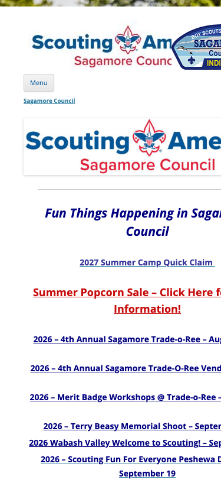
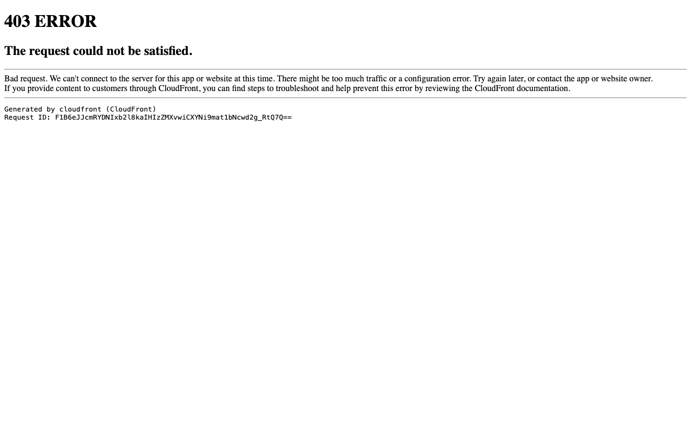
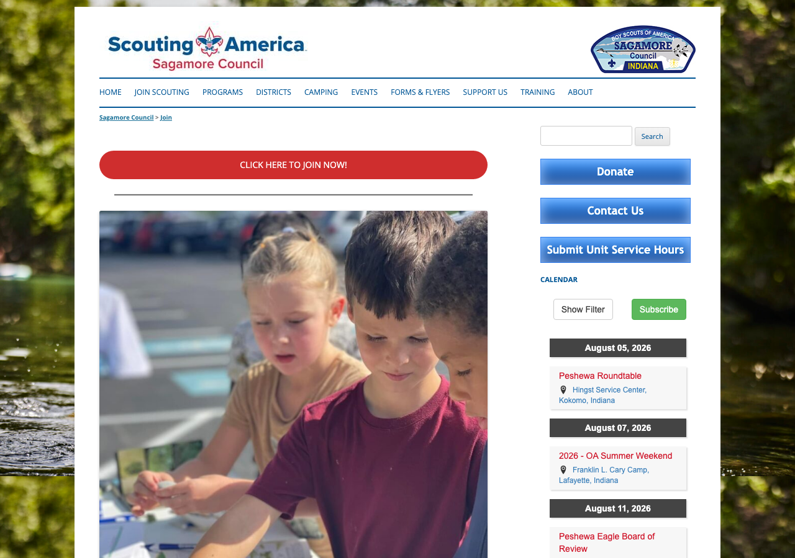
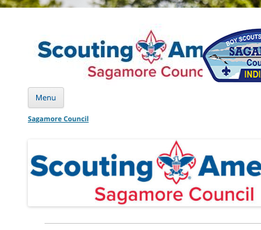
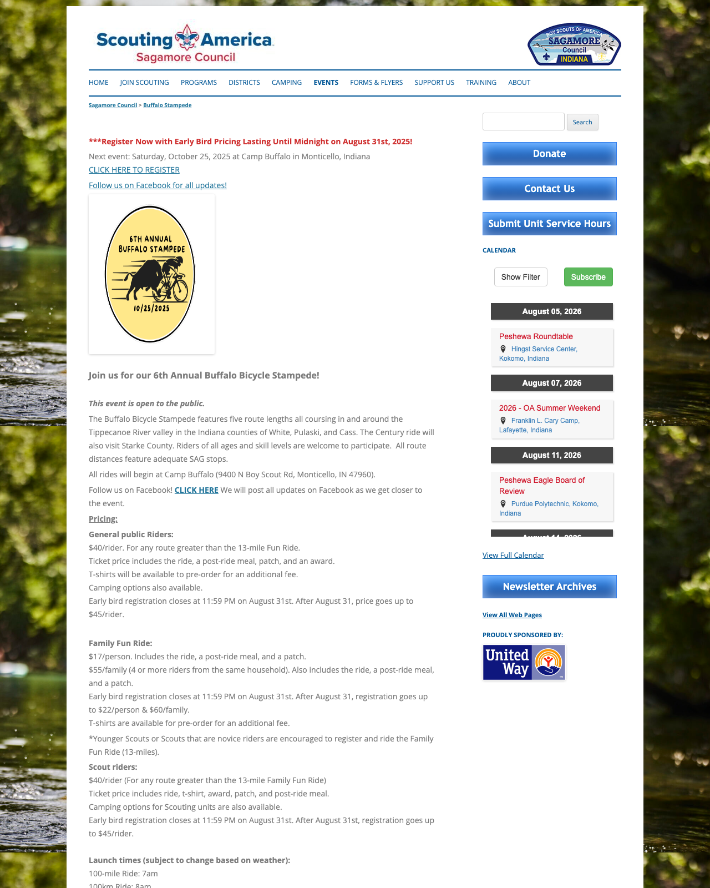
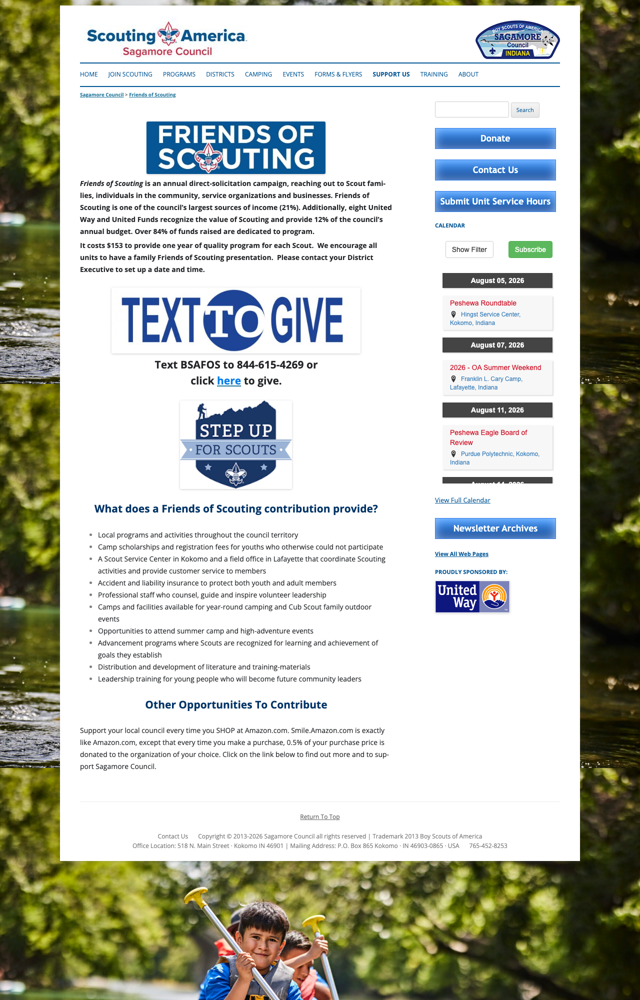

# Sagamore Council Website Review

**Prepared by the Purdue Daniels externship team | August 2026**
Reviewed sagamorecouncil.org on desktop and on a phone, since most parents will arrive on a phone.
Screenshots throughout were captured on 4 August 2026.

---

## What a prospective parent finds today

We walked the site as a 25-year-old parent of a kindergartener would, on a phone. Here is what that
parent can and cannot find.

| What they are looking for | What happens |
|---|---|
| What it costs | Not stated anywhere on the site |
| How to join | Two taps, then they leave for the national BeAScout page |
| The nearest pack or troop | Not named anywhere on the site |
| When it meets | Not stated anywhere on the site |

*The homepage as it appears on a phone. Below the header: a menu button, a second copy of the logo, then
"Fun Things Happening in Sagamore Council" and a list of event links.*

One measurement worth sitting with: **the word "join" does not appear anywhere in the text of the
homepage as it renders on a phone.** The navigation collapses behind a Menu button, and the homepage
content itself offers a popcorn sale, a Trade-o-Ree and a merit badge workshop. The Donate button is
there, but it sits about five full screens down once the page stacks for mobile.

Neither of your two goals, raising money and getting new kids, has a visible path on the device your
priority audience uses. Most of what follows is small, and several of the fixes take ten minutes.

---

## The three we would do first

### 1. The main "Join Now" button returns an error

The Cub Scouts page and the join page both link to `http://www.beascout.org/`, which returns a **403
error page**. The correct address is `https://beascout.scouting.org/`, which your top navigation already
uses. So the highest-intent click on the website currently ends on an error, with no way back.

*What a parent currently sees after tapping "CLICK HERE TO JOIN NOW!"*

One thing worth noting alongside it: the body text on the join page also tells parents to "sign-up NOW by
going to www.beascout.org," so the same dead address appears in the writing as well as the button. Your
top navigation already uses the working address, so both the working path and the broken one are live on
the site at the same time.

**Two link edits plus one line of copy, about 10 minutes.**

### 2. Your best page has nothing linking to it

The page at `/join/` is the strongest thing on the site. A clear join button above the fold, a real
photograph of real children that visibly includes a girl, a den-by-grade breakdown, and the line
"Scouting is for the whole family! Boys, girls, moms, dads, step-parents, grandparents."

**Nothing on the site links to it.** Not the navigation, not the mobile menu, not your own sitemap page.
The "Join Scouting" menu item skips it and sends people to the national site instead, which means you
never find out who was interested and cannot follow up with anyone who hesitated.

Its "New Parents, Click HERE" link also has a stray prefix in it (`chrome-extension//...`), which happens
when a URL gets copied out of a PDF viewer. That link is currently dead for every visitor. The fix is
deleting the first 52 characters.

*The join page. The button is well above the fold and the photograph shows real children, including a
girl at the front. Nothing on the site links here.*

**Pointing the menu at your own join page, plus that link fix, is about 15 minutes and is probably the
highest-value quarter hour available on the site.**

### 3. The cost of joining is not on the site, and the only price shown is the wrong one

We looked at every dollar figure on all 34 pages. The membership fee appears on none of them.

What a parent does find on the Cub Scouts page is **"$225 early bird price runs until June 1st / $250
normal price after June 2nd"** for an optional day camp. A parent reading that page concludes Cub Scouts
costs $225 to $250.

Cost is usually the first question a parent asks, and right now the site either does not answer it or
answers it with a number several times too high. For comparison, Atlanta Area Council states that pack
dues "typically range from $40 to $85 annually, and more depending on the level of adventure activities."
Simon Kenton Council lists the national fee and the council fee as separate line items.

**One page, "What Scouting Costs in Sagamore Council," plus a line on the Cub Scouts page clarifying
that $225 is an optional camp. Most of the hour is confirming the current council fee internally.**

---

## Branding

*The header at phone width. The patch covers the end of "America" and part of "Council," and the words
that read most clearly are BOY SCOUTS. The page also runs off the right edge of the screen, so a phone
visitor gets a sideways scroll.*

On a phone, the council patch image overlaps the "Scouting America / Sagamore Council" wordmark, covering
about 57% of it and cutting it off mid-word. The image sitting on top is the patch, whose largest, boldest
text is **BOY SCOUTS OF AMERICA**. So on a phone, the biggest words in your header are the old name.

Alongside that: the main logo's alt text still reads "Boy Scouts of America," which is what Google and
screen readers see; all 28 content pages carry "Trademark 2013 Boy Scouts of America" in the footer; and
the Google Business Profile still lists the organization as "Sagamore Council - Boy Scouts of America."

Scouting America's own *Digital Renaming Guidance* asks that council websites be updated no later than
**February 8, 2025**, and that new domains not contain "bsa."

Since girls are roughly a fifth to a quarter of new members, this is worth more than tidiness. One of
your own Google reviews reads, in part, "My daughter is a scout. Now I'm a den leader."

**The alt text, the footer line and the Google Business Profile name are about 15 minutes between them.
The header overlap on mobile needs someone comfortable in the site theme.**

---

## Pages still advertising things that already happened

*The Buffalo Stampede page, captured 4 August 2026. The 2025 event dates and the 2025 registration
deadline sit directly beside the site's own calendar showing August 2026.*

- **Buffalo Stampede**, a top-level menu item and your main public-facing community event, is entirely
  the 2025 edition. "Next event: Saturday, October 25, 2025," with 2025 registration deadlines. A cyclist
  who lands on it this month will reasonably conclude the ride is no longer running.
- **Cub Scouts** advertises Cub Adventure Camp sessions from June 2026, now about six weeks past, on the
  most important page for new families.
- **Friends of Scouting**, your main donor page, promotes **AmazonSmile**, which Amazon shut down in
  February 2023. The section ends "Click on the link below," and there is nothing below it.
- **Recharter** describes a "NEW PROCESS... beginning March 1, 2024" two and a half years on.
- **Contact Us** lists a North Star District Executive your own Facebook page replaced this week.

*The donations page. The instruction to click a link remains; the link itself is already gone.*

**About 30 to 40 minutes total, and it splits neatly into four separate ten-minute jobs.**

---

## Being found on Google

The site currently gives search engines very little to work with. There are no meta descriptions, so
Google is writing your search snippets for you. There are no Open Graph tags, which is why links you post
to Facebook appear as bare URLs with no image or description. No page title contains Kokomo, Lafayette,
Logansport or Indiana. One of the two sitemaps is empty; the other was generated in May 2014.

What we saw when we searched (these were checked by hand rather than captured, so they are worth
re-running yourself):

- "scouts Logansport Indiana" does not surface the council at all
- "cub scouts Lafayette Indiana" returns four individual packs, on free platforms, above the council in
  its own second-largest city
- "boy scouts Kokomo Indiana" returns eight results above the council

The encouraging read is that nobody is competing for these searches. They are open, which is why the
fixes are cheap.

**Adding city names to three page titles is about 15 minutes and is the single biggest search improvement
available.** Meta descriptions for the same three pages, another 20.

---

## Smaller items

- **Button contrast.** Donate, Contact Us, Submit Unit Service Hours and Newsletter Archives all use
  white text on mid-blue at a contrast ratio of 3.1 to 1. The accessibility standard for text that size
  is 4.5 to 1. Legible in good light, hard in sunlight or for anyone with reduced vision, which matters
  for parents reading on a phone outdoors. Darkening the blue fixes all four at once, about 20 minutes.
- **Mobile menu.** The menu control is built as a heading rather than a button, so it cannot be opened
  with a keyboard at all. Homepage event links are 19 pixels tall, below Apple's and Google's guidance
  for tap targets.

*The Camp Ranger line on the Contact page, with stray code visible and the email address exposed in plain
text. The line directly beneath it renders correctly.*

- **A few broken links.** `www.new.campbuffalo.com` has no DNS record, so dropping "new." fixes it. On
  Contact Us, the Camp Ranger line renders as visible broken code and exposes a staff email in plain
  text; the same pattern appears on ten pages. One district executive phone number uses a Tennessee area
  code and may be a typo. About 30 minutes for all of these.
- **Images.** 39 of 44 images have no alt text. The homepage contains no photographs of young people at
  all: every image is a logo, an icon or an event graphic. The Scouts BSA page's only real photograph is
  from 2012. The University of Scouting graphic has its date, venue and sponsors baked into the image, so
  none of that text is searchable or readable by a screen reader.

---

## What we would not spend time on

- **Site speed.** The homepage is 92KB and loads in under half a second. It is genuinely fine.
- **Moving off the `/htdocs/wordpress/` URLs.** There is a real search benefit in cleaner addresses, but
  it needs hosting changes and a full redirect map, and a partial migration would leave you worse off
  than today. Not worth it against the other items on this list.
- **The domain change off sagamorebsa.org.** Expected eventually, but it is a project rather than a task.

---

## Where to start

**Under ten minutes each, and they can be done in any order:**

| | Minutes |
|---|---|
| Repoint the two beascout.org links to `https://beascout.scouting.org/` | 10 |
| Point the "Join Scouting" menu item at your own `/join/` page | 10 |
| Remove the `chrome-extension//` prefix from the New Parents link | 5 |
| Change the logo alt text | 2 |
| Update the footer trademark line | 5 |
| Delete the AmazonSmile paragraph | 5 |
| Remove the past camp dates from the Cub Scouts page | 10 |
| Add "2026 dates coming soon" to Buffalo Stampede | 10 |
| Fix `new.campbuffalo.com` | 3 |
| Repair the Camp Ranger line on Contact Us | 10 |
| Update the North Star District Executive | 5 |
| Rename the Google Business Profile | 5 |
| Repoint the Google Business Profile website link | 5 |
| Add city names to three page titles | 15 |
| Write three meta descriptions | 20 |

**A few hours, no outside help needed:** the "What Scouting Costs" page · adding cost, meeting cadence
and district towns to the join page · rebuilding the top of the homepage around joining, using the
photograph already on the join page · alt text · an SEO plugin for Open Graph tags · fixing the sitemaps ·
darkening the buttons.

**Worth asking a volunteer for:** the mobile header overlap and the mobile menu are theme-level work. A
Scouting parent who does web work is a realistic route, as an in-kind contribution rather than a budget
line.

---

## Two things worth checking that we could not

**The BeAScout unit search.** We did not submit a ZIP search, so we do not know whether packs actually
appear for Kokomo, Lafayette and Logansport, or whether the pins, meeting times and contacts are current.
**This is worth ten minutes of your time before anything else on this list**, because every fix above
hands a parent to that search. If the results are thin or stale, that becomes the first priority.

**Google Search Console.** How many of your pages Google has actually indexed is visible from the account
you already have, and we could not see it from outside.

---

## One asset worth knowing about

Your Google Business Profile carries **4.6 stars across 18 reviews**, with a correct address, hours,
phone and category. The only two defects are the organization name and the website link, both five-minute
fixes. Nothing else on this list buys that much credibility that cheaply.
