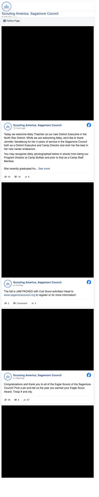
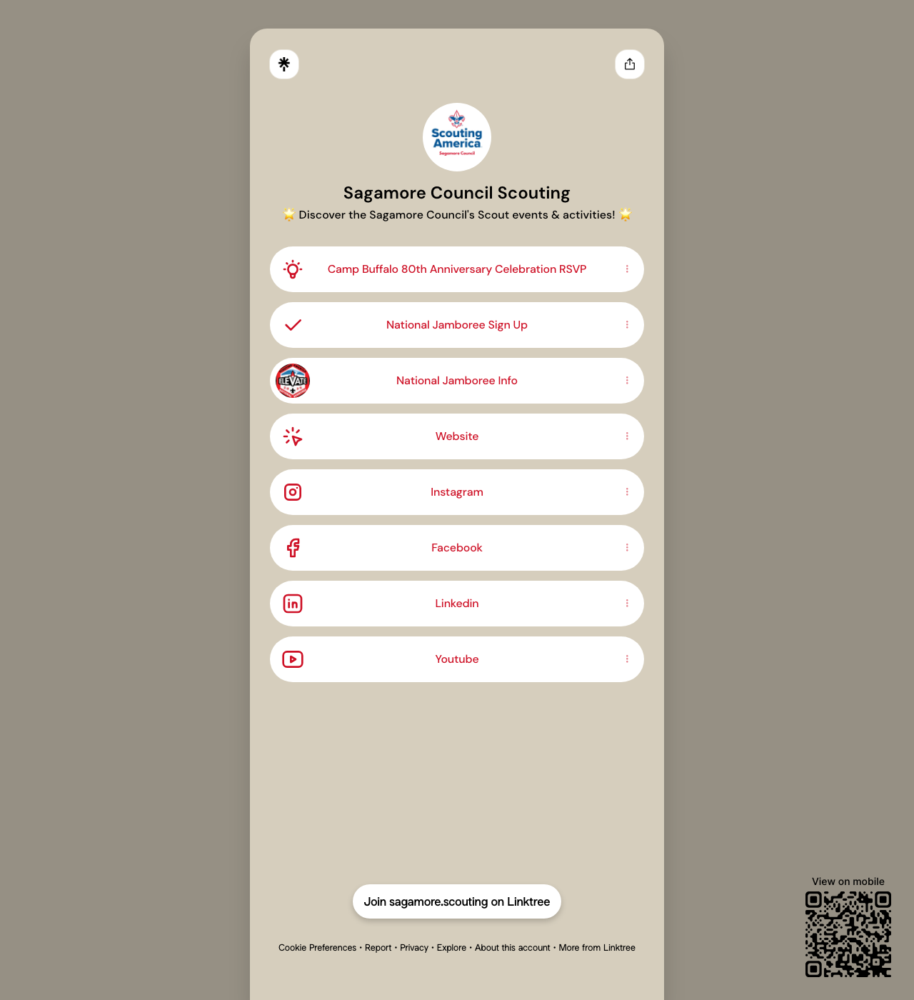
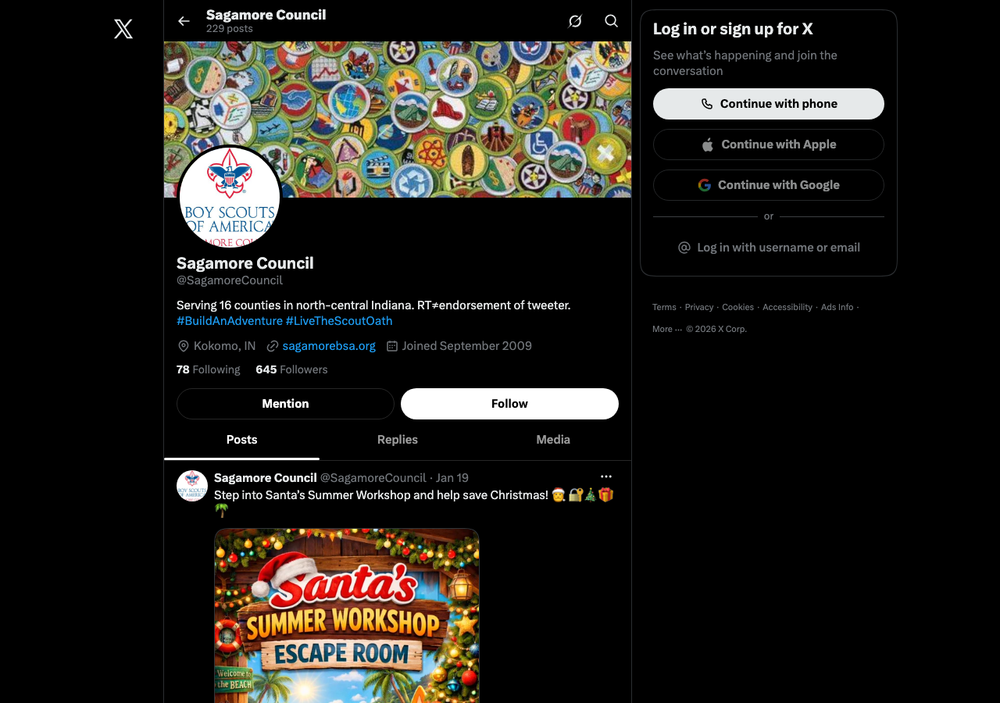
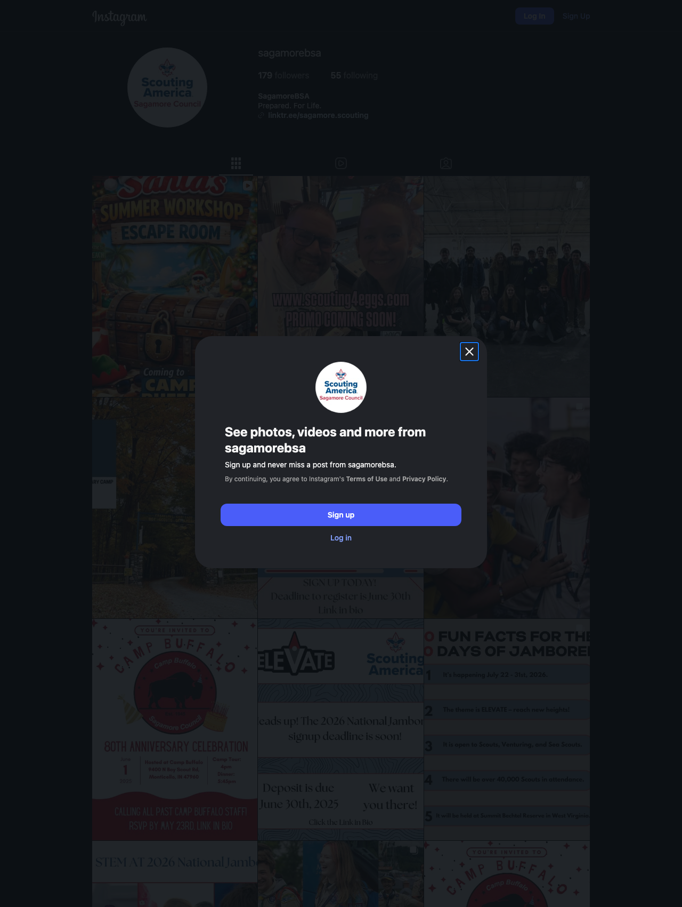

# Sagamore Council social media audit — 2026-08-04

> **INTERNAL VERSION. Do not send as-is.** Needs the client-facing pass (CLAUDE.md, "Before telling him
> to send anything"). Audited read-only, logged out of every platform.
>
> **Screenshots in `networking/audit-screenshots/`** (captured 2026-08-04, headless Chrome, every file
> visually verified). Two corrections the capture forced, both applied below: **(a)** Takachsin has
> **two** truly bare-URL posts, not three — the third has one sentence above the same link. **(b)** The
> Facebook embed reports **likes**, while the figures in this audit are **all reaction types**, which is
> why the embed shows 44/48 where the audit says 58/55. Both are correct; cite whichever matches the
> evidence being shown.
>
> **Not evidenced by any screenshot and must not be sourced to one:** Instagram's 59-post count (not
> rendered logged out) and Facebook's 3,512 followers (clipped in every embed layout tried).

## The inventory is wrong in the brief. There are 11 accounts, not 6.

| Account | Handle | Followers | Last post | Verdict |
|---|---|---|---|---|
| FB Council | **SagamoreBSA** | **3,512** | Aug 4 | The only real channel |
| FB Camp Buffalo | CampBuffalo | 1,030 | Aug 1 | Semi-active |
| FB Cary Camp | CaryCampBSA | 770 | Aug 4 | **Best voice you own** |
| FB Takachsin Lodge (OA) | TakachsinLodge | 613 | Aug 2 | Posting bare URLs |
| FB Wabash Valley District | LafayetteScouting | 373 | Aug 1 | Reshare bin |
| FB North Star District | NorthStarSagamore | 358 | Aug 3 | Near-dormant |
| FB Peshewa District | `profile.php?id=100069600199471` | 332 | Aug 1 | **No username at all** |
| Instagram | sagamorebsa | 179 | **Jan 18, 2026** | Dormant 199 days |
| X | **SagamoreCouncil** | 645 | **Jan 19, 2026** | Dead |
| LinkedIn | sagamorebsa | 85 | ~Jun 2026 | Barely alive |
| YouTube | @sagamore162 | 51 subs, 95 videos | Jul 22 | Training file cabinet |

**Three corrections to the brief.** (1) The website footer links to `twitter.com/SagamoreBSA`, which
**404s**; the real handle is @SagamoreCouncil. (2) **No "University of Scouting" Facebook page exists**
that could be found across seven candidate handles — the ~600-follower page is Takachsin Lodge. (3)
Instagram is 179, and dead since January, not "posted occasionally."

## Findings

**1. The reach machine was found and abandoned: Facebook Reels.** The Page has made **10 Reels, ever.**
Top: **9,300 views / 189 reactions** on a phone pan of a room captioned "Good Morning from the Purdue
Armory at University of Scouting!!!" Then 3,500, 3,500, 2,300. Bottom: **206 views** on a Reel that
opens with a pasted URL and asks people to register. **45x spread on the same page.** The 9,300 Reel
reached **265% of the 3,512 follower count**, against a nonprofit Facebook organic-reach average around
2.2% (Nonprofit Tech for Good citing Social Status — directional, the attribution is inconsistent).
Metricool's 2026 study (1,059,949 accounts, 39.7M posts, 2025 data) found **Facebook reach up 51% YoY**
while Instagram Reels reach fell 35%. All four big Reels were shot **on one day in December at one
event** and never repeated. **Fix: one 15-30 second vertical video, unedited, at every event he already
attends, posted same day, one-line caption, no link. 3 min to shoot, 4 to post.** Highest-return item in
either audit.

**2. The Eagle Scout post is a format, and he already ran it again.** Last five council posts:

*`soc-06-facebook-embed.png` — the whole argument in one frame. Three consecutive posts: Abby Thatcher (named people, no link) **44 likes / 18 comments / 8 shares**, then "The fall is JAM PACKED with Cub Scout activities! Head to www.sagamorecouncil.org" **2 / 0 / 2**, then the Eagle Scout ask **48 / 8 / 27**. The link post sits between two named-person posts, same page, same week. Post images render black because the embed lazy-loads them and headless never fires the load; text and counts are crisp.*

| Date | Post | React | Comments | Shares |
|---|---|---|---|---|
| Aug 4 | New DE Abby Thatcher, real photo, named people, **no link** | 58 | 21 | 8 |
| Aug 3 | "fall is JAM PACKED with Cub Scout activities" **+ register link** | **2** | 0 | 2 |
| Aug 1 | Eagle Scouts, **"Post a pic and tell us the year, Troop # and city"** | 55 | 8 | **27** |
| Aug 1 | World Scarf Day **+ shop link** | **10** | 0 | 5 |
| Jul 31 | Jamboree Day 10, 25+ photos, 5 named leaders | **77** | 1 | 1 |

Named human, no link: 58 / 55 / 77. Registration or shop link: **2 and 10.** A 20x gap on the same page
in four days. Matches Socialinsider (25M posts, 130,683 Pages, 2025): native status **0.20%** engagement
vs link posts **0.05%**. Note honestly: Meta's Transparency Center does **not** list ordinary link posts
as demoted; the link disadvantage is observed, not stated policy. **The recruitment post for the priority
audience got 2 reactions on a 3,512-follower page.**

**3. Six satellite pages hold 2,863 followers and returned four reactions.** The Aug 1 Eagle post was
shared to all five satellites: North Star 1, Wabash Valley 2, Camp Buffalo 1, Cary Camp 0, Peshewa 0.
**Total 4 reactions, 3 comments, from 2,863 followers**, against 55/8/27 on the council page. Between
shares, Wabash Valley reposts *other organizations* including an engagement-farm page ("Dig the Games,"
135,770 followers, "One-Hand Ball Challenge #partygames"). North Star: 5 posts in six months. Takachsin:
**two of its last five posts are a bare URL with no text at all**, and three consecutive posts push the identical link `scoutingevent.com/162-102811` (the third carries one sentence above it) — 0, 2, 0 reactions. Evidence: `audit-screenshots/soc-07-takachsin-bare-url.png`. The exception is
**Cary Camp**, unmanaged and the best-written page they own ("Huge shoutout to Owen Babiak for mowing at
camp today"). Nonprofit Marketing Guide's 2026 Trends Report (n=322, Dec 2025) finds effectiveness peaks
at four to six goals and quotes a solo communicator: "We end up spreading our efforts across too many
channels." **Fix: 80% of time on the council page; leave Cary Camp and Camp Buffalo alone; stop
cross-posting to the three district pages and have district volunteers share to their personal feeds
instead. Saves 1.5-2 hrs/month.**

*`soc-01-linktree.png` — proves the finding by exhaustion: the entire list fits in frame with empty space beneath it. Camp Buffalo 80th RSVP (expired), National Jamboree Sign Up, Jamboree Info, Website, then four social icons. **No Join. No Donate.***

**4. The link in bio contains no way to join and no way to donate.** Instagram's only clickable link is
`linktr.ee/sagamore.scouting`. Complete contents: Camp Buffalo 80th RSVP (past), **National Jamboree
Sign Up**, Jamboree Info, website (pointing at `/htdocs/wordpress/`), then four social icons. His own
Jul 31 post says the Jamboree contingent **came home**. The sign-up is still item two on Aug 4. For an
org whose success criterion is money and membership, the one destination he controls offers neither.
**Fix: four links — Join, Donate, Events, Website. 15 min once.**

**5. Parents comment their children's names and nobody replies.** From the Aug 1 post: "My son
Nathaniel. Class of 2025 with Troop 816!" · "My son Jacoby. He got his Eagle on 4/7/2026." · "Zachary
Cline 2019 Troop 527 Russiaville/Kokomo." **No page reply found on any of them.** LinkedIn: five posts,
**zero comments, ten months.** Every commenter volunteered their child's name, unit, town and emotional
investment in public. **That is the Friends of Scouting list building itself and nobody is harvesting
it.** Fix: 10 min, ~24 hrs after any post that asks a question, reply by name, then screenshot the thread
into a list for development.

*`soc-02-x-old-logo.png` — the profile picture is unambiguously the pre-rebrand Boy Scouts of America mark while the cover photo is current. 645 followers, 229 posts, joined Sept 2009, last post Jan 19.*

*`soc-04-instagram-profile.png` — display name "SagamoreBSA", bio reading only "Prepared. For Life.", 179 followers, and the "PROMO COMING SOON!" tile in the grid. Captured tall so the grid clears the signup modal.*

**6. Instagram dead 199 days; X still carries the old BSA logo.** Instagram display name is
"SagamoreBSA", bio is "Prepared. For Life." and nothing else — no city, no age range, no indication it
is a youth program. The grid includes a tile reading "**PROMO COMING SOON!**" X's profile picture is the
full pre-rebrand **Boy Scouts of America** mark, live today; five posts in three years; the Jan 2026 one
got **12 views**. Pew (Nov 12 2025, n=3,054 parents of under-12s): **47% of parents whose oldest is
under five** use online parenting communities regularly, as do **45% of parents 18-29** — exactly the
target. **Recommendation: park Instagram properly, do not revive it.** At 179 followers and Rival IQ's
nonprofit Instagram engagement rate of 0.22%, a post earns well under one engagement. NPMG 2026: **31%
of nonprofits named Facebook the platform that most reliably hit objectives, and only 4% want to invest
more in it**, while 70%+ of those wanting more Instagram are solo communicators "searching for direction
rather than following evidence." Also: hashtags are not a lever — Mosseri said in 2025 they are "not a
way to get more reach," hashtag following was removed Dec 13 2024, and a five-hashtag cap landed Dec 19
2025. **X: formally abandon, do not delete** (an abandoned handle for a youth org is an impersonation
risk). Fix the logo, one-line bio, pin "we're most active on Facebook," never open it again.

**7. Live embarrassments.** Dead Twitter link in the website footer · old BSA logo on X · Jamboree
sign-up still live 4 days after the contingent came home · expired Camp Buffalo RSVP as the top Linktree
item · Instagram dormant with a bio that says nothing · "PROMO COMING SOON!" tile · Peshewa has no
username so it is unfindable and unlinkable · the website's Peshewa link uses the legacy BSA slug · no
website links to Camp Buffalo, Cary Camp, Takachsin or North Star · Facebook website field is `http://`
· a public YouTube video titled "2026 Popcorn Training **Raw Video**" · three bare-URL posts in one week
· **two domains with no canonical** (FB says sagamorecouncil.org, X and LinkedIn say sagamorebsa.org).

**8. 14 reviews at 100% recommend, unused.** Plus 116 check-ins and 1,117 "talking about this." NPMG
2026: **56% of nonprofits rate word-of-mouth very or extremely important**, ahead of advertising (29%)
and search (24%). Afterschool Alliance *America After 3PM* (Oct 2025, n=30,515 parents): **95% of
parents in out-of-school programs are satisfied.** Fix: one message to unit leaders asking three parents
each for a recommendation. 10 min.

## The repeatable format: "The Friday Name"

Six lines, same day and time weekly, 15 minutes.

1. **His line.** Name, unit, town. *"Braeden Miller of Troop 527 in Russiaville became an Eagle Scout this week."*
2-4. **Not his line.** Two or three sentences in quotation marks from a parent, leader or the Scout, attributed. *"His dad Mike told us: 'Four years ago he wouldn't order his own food at a restaurant. Last month he ran a project with nineteen volunteers.'"*
5. **His closing line.** Short, no adjectives. *"That is what this is for."*
6. **The ask, aimed at the reader's own memory.** *"Who is the Scout in your family? Tell us their name and troop."*

One real photo, faces visible, phone quality is correct not a compromise. Two emoji maximum. **No link —
if there is something to sign up for, it goes in the first comment.** Then 10 minutes the next day
replying by name.

**Why it works:** a celebration post about one boy is a feel-good post. A celebration post that invites
3,000 people to celebrate *their own* boy is a donor list building itself in public. That is why the
Aug 1 version got **27 shares**, five times any other recent post.

**Never runs dry:** Eagle boards of review produce a list every month. One standing email to the
advancement chair — name, troop, town, parent contact, the week the board clears — and the queue is
permanent.

**⚠ The permission problem, fix before the next one.** The benchmark post was built from a photo taken
off the dad's personal Facebook page. Guidance from Lawyers Alliance for New York, Nonprofit Marketing
Guide and Bonterra converges on **written consent for images of children**, with the release specifying
intended use. Taking a photo off a parent's profile misses on consent and copyright. The fix is cheap
and improves performance: *"That photo of Braeden is wonderful. May we use it and your words on the
council page?"* Parents who say yes **share the post when it goes up.** Then add a photo-release line to
pack and troop registration.

**Laddering to money and membership — stop asking one post to do both.** The Friday Name reaches parents
and Eagle alumni: that is the **donor** list, harvested weekly, with development making the ask two weeks
later, not in the post. Reels reach strangers: that is the **membership** pipeline, and that is where a
join link belongs. He was right that a feel-good post does not raise money. It does not raise money *on
its own.* It builds the list you then ask.

## Content mix (estimated from a 5-post sample + 10 Reels + satellites)

| Category | Estimated | His goal |
|---|---|---|
| Event promotion / registration / merch | **~55%** | 25% |
| Achievement and celebration | ~30% | 25% |
| Storytelling | ~10% | 25% |
| Community education | ~5% | 25% |
| **Recruitment aimed at non-Scouting parents** | **~0%** | 25% |

**Nothing in the visible feed addresses a parent who does not already have a Scout.** Every post assumes
the reader is already inside. The priority audience is addressed nowhere, on any account.

## The handle change: least valuable thing on his list

Say it plainly before giving steps. **Nothing in the data suggests "BSA" in the URL costs a single
member.** Findings 1, 2 and 4 do. Do those first. Also, the hard part is already done: display names are
correct post-rebrand on all seven FB pages, Instagram's account, LinkedIn and Linktree. The only place
old branding appears **as branding** is the X profile picture, a 10-minute fix. What remains is the slug.

**Facebook:** Settings → Page setup → Username, desktop only per Facebook Help Center. **Nothing
resets** — Page ID, 3,512 followers, post history, 14 reviews, 116 check-ins all survive. **What breaks:
every link using `facebook.com/SagamoreBSA`** (website footer, Linktree, search results). Meta publishes
no statement that old custom usernames redirect; **assume they do not.** The Peshewa legacy URL still
resolving proves nothing — that is an auto-generated slug containing the numeric Page ID, which always
resolves. **The "60 day limit" appears only in third-party blogs and could not be confirmed on any
Meta-owned page. Treat as folklore.** Real risk: a freed username can be claimed by anyone, and an
impostor on a youth org's old handle is a genuine hazard.

**Instagram:** change the **display name** ("SagamoreBSA" → "Scouting America | Sagamore Council") —
free, breaks nothing, do it today. **Do not change the username**; the payoff at 179 followers is zero.

## If he does only three things

1. **One raw vertical Reel at every event he already attends.** 10 min per event.
2. **The Friday Name weekly, plus replying by name.** 25 min per week.
3. **Rewrite the Linktree so Join and Donate are the top two links.** 15 min once.

**Under 45 minutes a week**, inside his 6 hours a month, replacing work he already does on pages
returning four reactions.

## What could not be seen

The **June 28 post itself** — Facebook serves logged-out visitors one post from a Page timeline and the
public embed caps at five, so the format above is reconstructed from the Aug 1 repeat (read in full,
including comments) plus measured performance across the visible feed. **All Page Insights** (reach,
impressions, link clicks, follower demographics) are admin-only and **nothing was estimated from them**.
**Whether any post is pinned** — not visible logged out, and it takes him 10 seconds to check. The
Facebook inbox. **Whether the Page has a CTA button** — none rendered logged out, suggestive not
conclusive; if absent, adding "Sign Up" pointed at the join page is a 2-minute fix. Meta Business Suite
settings, so the FB-IG link status is inference from behaviour (almost certainly not linked: Facebook
posted daily through early August while Instagram's last post is January). Instagram per-post
engagement, Stories, Highlights. Cadence of 4-6 posts/week is an **estimate** from a five-post window.

## Sources

Socialinsider Facebook + Instagram Benchmarks (2025) · Rival IQ Nonprofits Live Benchmarks · Nonprofit
Tech for Good 2026 Social Media Statistics for Nonprofits · Metricool 2026 Social Media Study · Meta
Transparency Center (Feed Ranking; Types of content we demote) · Nonprofit Marketing Guide 2026 Trends
Report (n=322) · Afterschool Alliance America After 3PM Oct 2025 (n=30,515) · Pew Research Nov 12 2025
(n=3,054) · Aspen Project Play State of Play 2025 · Facebook Help Center 203523569682738 and
121237621291199 · TechCrunch Apr 30 2026 · Lawyers Alliance for New York (2019, dated) · Bonterra photo
policy guidance.
