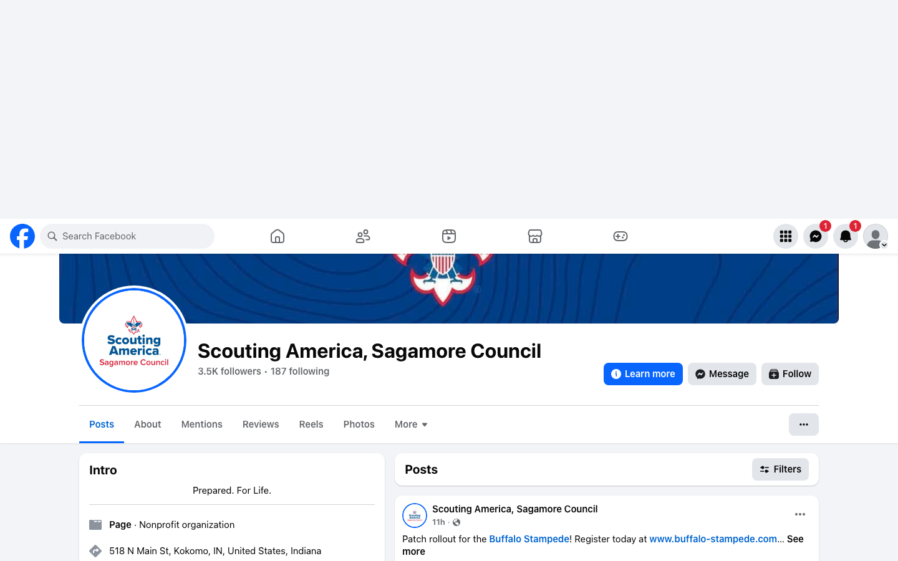
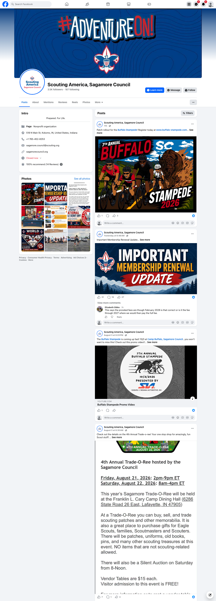
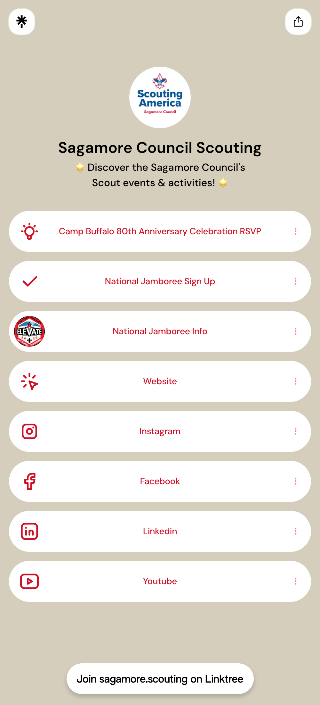
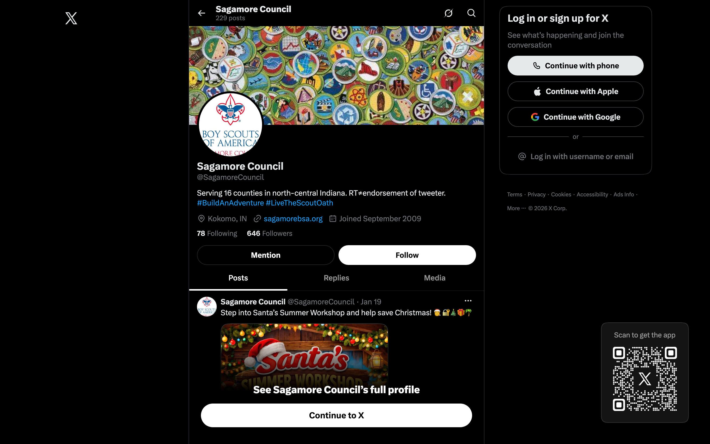
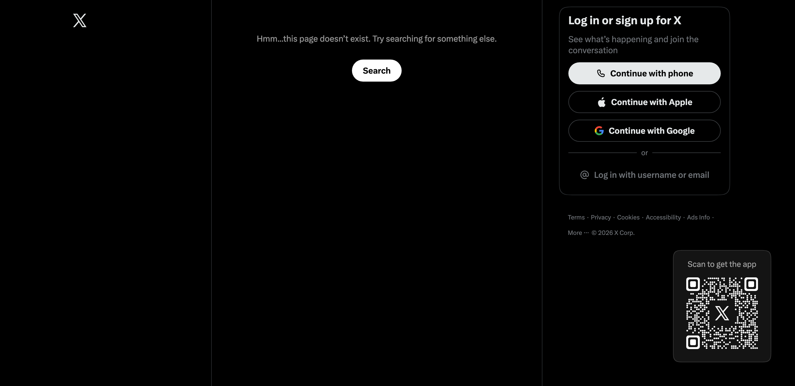
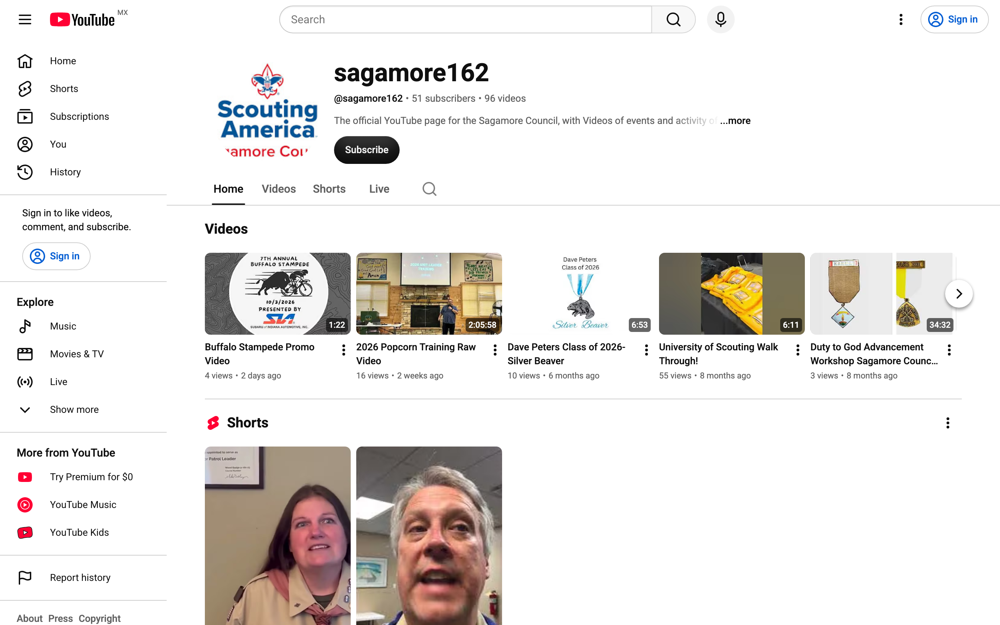

# Sagamore Council Social Media Review

**Prepared by the Purdue Daniels externship team | August 2026**
Reviewed the way a parent or donor sees the accounts. Screenshots were captured 4 August 2026; every
figure was **re-checked on 7 August 2026** against a fuller sample of twenty posts. Where the second look
changed a conclusion, we have changed it here rather than softened it.

---

## The short version

You already know what works. It is in your own numbers, twice, and it is not the thing most of the
posting time currently goes to.

Across your last twenty posts, one rule holds without exception: **every post containing an outside link
underperformed.** All five of them landed between 1 and 11 reactions, on a page of roughly 3,500 people.

What works instead is not one format but three, and they are all cheaper than what you are making now:

- **Showing something that already happened.** Your Jamboree recaps took 279, 128, 92 and 68 reactions.
- **News about a person.** Welcoming your new District Executive took 69 reactions and 22 comments.
- **Asking readers to tell you something about themselves.** The August 1 Eagle Scout post took 27 shares,
  more than any other post in the sample, because it asked people to name their own Eagle Scout.

And the thing that performs *worst* among your link-free posts is **event promotion** — which is a quarter
of everything you publish. You are posting mostly to fill events, and that is the part that is not landing.

---

## What is actually there

We found eleven accounts across five platforms.

*The council page, captured 7 August: 3.5K followers, 187 following, and a 100% recommendation rate
across 14 reviews. This is the channel that matters — the other ten together do not come close.*

| Account | Followers | Last post | State |
|---|---|---|---|
| Facebook, council | 3.5K | Current | Active, and the only channel that matters |
| Facebook, Camp Buffalo | 1,030 | Aug 1 | Semi-active |
| Facebook, Cary Camp | 770 | Current | Active, and the best-written page you own |
| Facebook, Takachsin Lodge | 613 | Aug 2 | Active |
| Facebook, Wabash Valley District | 373 | Aug 1 | Mostly reshares |
| Facebook, North Star District | 358 | Aug 3 | Near-dormant |
| Facebook, Peshewa District | 332 | Aug 1 | Near-dormant, and has no username |
| Instagram | 179 | January 18 | Dormant |
| X / Twitter | 645 | January 19 | Dormant |
| LinkedIn | 85 | June | Barely active |
| YouTube | 51 subscribers, 95 videos | July 22 | Used as a training archive |

Three notes on this list. Your website footer links to `twitter.com/SagamoreBSA`, which does not exist and
returns a 404; the live account is **@SagamoreCouncil**. There is **no University of Scouting Facebook
page** — that is an event, not an account, and the roughly 600-follower page is Takachsin Lodge.

And one pattern only visible once the list is laid out: **Instagram and X both went silent on the same
day, 18 and 19 January 2026.** That is a single moment when the extra channels were let go, not two
separate lapses — which is worth knowing, because it means there is one decision to revisit, not five.

---

## 1. Reels are reaching people, and there have only been ten of them

Your page has published ten Facebook Reels in total. Here is what they did:

| Views | What it was |
|---|---|
| **9,400** | "Good Morning from the Purdue Armory at University of Scouting!!!" |
| 3,500 | "University of Scouting at Purdue University presented by IU Health was AMAZING!" |
| 3,400 | "Lunchtime at University of Scouting!" |
| 2,300 | "To God and our Country... scene from today's opening ceremony" |
| **207** | Opens with a pasted registration link, then asks people to sign up |

The 9,400 view Reel is a phone pan of a room, and it carries 189 reactions. It reached nearly three times
your entire follower count, which means it went well beyond the families who already follow you, and that
is the only way new families find you. The 207 view Reel is the one that opens with a link and an ask.

The four big ones sit **consecutively in your Reels history**, which means they were made in one burst at
one event and the format has not been used since. Ten Reels total, on a page you have had since 2009.

**What we would suggest.** At every event you are already attending, take one **fifteen to thirty second
vertical video**, unedited, with people and noise in it, and post it that day with a one-line caption and
no link. Not a promotion, a moment. The four that worked are literally "good morning from the room,"
"lunchtime," "the opening ceremony," and "that was amazing."

About three minutes to shoot and four to post, at events you are already at.

---

## 2. The Eagle Scout post is a repeatable format, and you have already run it twice

You mentioned the June Eagle Scout post as your best in three years. You ran the same shape again on
August 1, and it worked again. Your last five council posts:

| Post | Reactions | Comments | Shares |
|---|---|---|---|
| Welcoming Abby Thatcher, real photo, named people, no link | 58 | 21 | 8 |
| "The fall is JAM PACKED with Cub Scout activities" + register link | **2** | 0 | 2 |
| "Congratulations to all of the Eagle Scouts... post a pic and tell us the year, Troop # and city" | 55 | 8 | **27** |
| World Scarf Day + shop link | **10** | 0 | 5 |
| Jamboree Day 10, photos, five named leaders | 77 | 1 | 1 |

Looking at twenty posts rather than five sharpens this, and it is worth being precise because the precise
version is more useful to you.

**The link penalty is absolute.** Every one of your last five posts carrying an outside link scored
between 1 and 11 reactions. No exceptions. That matches the wider data: across 130,683 business pages,
plain posts earn roughly four times the engagement of link posts.

**But "put a person in it" is not by itself the trick.** A July 31 photograph full of Scouts, no link,
drew five reactions. What separates your winners is that the reader is given something to *do* or someone
to *know*:

| | Reactions | What it gave the reader |
|---|---|---|
| June 28 Eagle Scout, named, with his story | **770** | A specific person to be glad about |
| Jamboree Day 5 recap | 279 | Something that actually happened |
| New District Executive | 69 | A name to put to the council |
| August 1 Eagle prompt | 56, **27 shares** | An invitation to name their own |
| Membership fee update | 29, **19 comments** | Information they needed |
| Photo of Scouts, unnamed | 5 | A nice picture |

So: a name plus a story is your strongest asset, a question is your strongest share-driver, and a link is
a reliable way to be ignored.

The uncomfortable part is that your recruitment and fundraising posts are the ones nobody is seeing. The
Cub Scout activities post, the closest thing in your feed to a recruitment message for young families,
reached two reactions on a page of roughly 3,500.

### The format, written out

Same day and time every week. Six lines, about fifteen minutes.

> **One line from you.** Name, unit, town.
> *"Braeden Miller of Troop 527 in Russiaville became an Eagle Scout this week."*
>
> **Two or three sentences that are not yours,** in quotation marks, from a parent, a leader or the Scout,
> with their name on it.
> *"His dad Mike told us: 'Four years ago he wouldn't order his own food at a restaurant. Last month he
> ran a project with nineteen volunteers.'"*
>
> **One closing line from you.** Short.
> *"That is what this is for."*
>
> **The ask, pointed at the reader's own memory.**
> *"Who is the Scout in your family? Tell us their name and troop."*

One real photograph, faces visible. Phone quality is right, not a compromise. Two emoji at most. No link
in the post; if there is something to sign up for, it goes in the first comment.

**Why the last line is the one that matters.** A post celebrating one boy is a nice post. A post that
invites three thousand people to celebrate their own boy is something else. That is why the August 1
version drew 27 shares, more than five times any other recent post, and why the comments read like this:

> "My son Nathaniel. Class of 2025 with Troop 816!"
> "My son Jacoby. He got his Eagle on 4/7/2026."
> "Zachary Cline 2019 Troop 527 Russiaville/Kokomo"

**Where the material comes from.** Eagle boards of review produce a list every month. One standing note to
your advancement chair asking for each Eagle's name, troop, town and parent contact the week their board
clears, and the queue never runs out.

**One thing to sort out first.** The June post used a photograph taken from the father's own Facebook
page. For images of young people the standard is written permission, specifying what the image will be
used for, and that also settles who owns the photo. A single message solves it, and it tends to improve
the post: *"That photograph of Braeden is wonderful. May we use it, and your words, on the council page?"*
Parents who say yes usually share the post themselves when it goes up. Adding a photo release line to pack
and troop registration handles it permanently.

---

## 3. The comments are a list, and nobody is collecting it

Under the August 1 post, parents volunteered their child's name, troop number, town, and the fact that
they care about Scouting. In public. Unprompted.

We could not find a reply from the page on any of them. On LinkedIn it is absolute: five posts, zero
comments, over ten months.

That is a Friends of Scouting list identifying itself, and it is currently scrolling past.

**And there is a second, more urgent version of this.** Your **6 August membership fee update** has drawn
**31 reactions, 27 shares and 19 comments** — the most-discussed post on your page right now. Several of
those comments are parents asking plainly what the fee is and how renewal works. **None of them has been
answered.**

*Your page as it stands on 7 August. Three things are visible in this one frame. The Buffalo Stampede
patch post at the top carries a link and has **1 reaction**. The Buffalo Stampede promo video below
carries a YouTube link and has **1 reaction**. Between them, the membership renewal update, which carries
no link, has **31 reactions, 19 comments and 27 shares**. And under it a parent has asked, in public,
whether the prorated fees run through February 2028 or through 2027 — a specific, answerable question,
sitting unanswered with "View more comments" beneath it.*

That comment is the whole argument of this review in one place: **a parent trying to give you money and
not being able to find out how much.**

That one is not a missed list, it is a missed service moment, and it connects to something the website
review found independently: the membership cost appears on none of your 34 web pages, and you do not
appear at all in Google results for "how much does scouting cost," where four peer councils do. **Parents
cannot find the number on your site, cannot find it in search, so they ask you in public — and hear
nothing.** Answering those nineteen comments is ten minutes and it is the highest-value ten minutes in
this document.

**What we would suggest.** Ten minutes, about a day after any post that asks a question. Reply to each
comment **by name**, one line each: *"Congratulations to Nathaniel, Charmaine. Troop 816 has turned out
some great ones."* Then keep the list of names for the development conversation.

---

## 4. The extra Facebook pages are costing time and returning very little

Your August 1 Eagle Scout post was shared to five other pages. Between them those pages have roughly
**2,800 followers** — Takachsin Lodge 613, Camp Buffalo about 1,000, Wabash Valley 376, North Star 358,
Peshewa 332, Wood Badge 100. The shares produced **four reactions and three comments in total**, against
56 reactions, 8 comments and 27 shares on the council page.

Between those shares, several of the pages are posting other organizations' content, and one has posted the
same link three times in a week, twice with no text at all, which is the lowest-performing thing it is
possible to post.

The exception is **Cary Camp**, which is the best-written page in the family and appears to be run
locally: *"Huge shoutout to Owen Babiak for mowing at camp today while I worked on maintenance items -
scouts are the best."* Named people, present tense, real voice. It is doing instinctively what section 2
recommends.

**What we would suggest.** Put roughly 80% of the time on the council page. Leave Cary Camp and Camp
Buffalo alone, since they have their own voices and their own audiences. Stop cross-posting to the three
district pages and instead ask district volunteers to share council posts to their **personal** feeds,
which reaches actual people rather than a 358-follower page. That alone gives back somewhere near two
hours a month.

---

## 5. Your only clickable link offers no way to join and no way to give

*Your Linktree in full, captured 7 August. Everything on it fits in this frame. Read the first two items
in order: an RSVP for an event that has passed, then a Jamboree sign-up. Then look for a way to join, or
a way to give.*

The single link on your Instagram profile goes to a Linktree containing, in this order: a Camp Buffalo
80th Anniversary RSVP that has passed, a **National Jamboree sign-up**, Jamboree information, your
website, and then four social icons.

Your own July 31 post announced that the Jamboree contingent came home. The sign-up is still the second
item.

There is no join link, no BeAScout link, and no donate link.

**Four links, in this order: Join Scouting. Donate. Upcoming Events. Website.** Remove the rest, including
the social icons, since anyone looking at that page is already on your social. Fifteen minutes once, then
a five-minute check on the first Monday of the month.

---

## 6. Instagram and X

*Your live X account, @SagamoreCouncil, captured 7 August. The cover image is current; the profile
picture is still the previous Boy Scouts of America logo.*

*And this is where the Twitter link in your website footer goes. It points at `@SagamoreBSA`, a handle
that does not exist, so every visitor who clicks it lands here rather than on the account above.*

**Instagram** has not posted since January 18. The profile name reads "SagamoreBSA" and the bio is
"Prepared. For Life." and nothing else, so a parent cannot tell what the organization is, who it serves,
or where it operates. The grid includes a tile reading "PROMO COMING SOON!"

*(No screenshot: Instagram serves logged-out visitors a sign-up wall over a dimmed grid, so any capture
shows the wall rather than your profile. The figures above are read from the live page — check them at
[instagram.com/sagamorebsa](https://www.instagram.com/sagamorebsa/).)*

**Our honest recommendation is to park it properly rather than try to revive it.** At 179 followers, a
typical nonprofit post there earns well under one interaction. The wider pattern supports this: 31% of
nonprofits name Facebook as the platform that most reliably helps them meet their goals, while only 4%
want to invest more in it. Facebook is unglamorous, and it is the one working for you.

So: change the display name to "Scouting America | Sagamore Council," rewrite the bio to say what you are
and where, and leave it. About twenty minutes, once. If a second person ever takes on communications,
revisit it then.

**X** has published five posts in three years, and the most recent drew twelve views. **The profile
picture is still the old Boy Scouts of America logo.** We would suggest keeping the account rather than
deleting it, since an abandoned handle belonging to a youth organization is worth holding onto, but
updating the logo, rewriting the bio in one line, pinning a post that says you are most active on
Facebook, and leaving it there. Ten minutes.

---

## 7. Small things that are visible right now

- The Twitter link in your website footer returns a 404
- The old Boy Scouts of America logo is your X profile picture
- **Your August 1 neckerchief post carries Facebook's "AI content" label.** For an organization asking
  parents to trust it with their children, an AI tag on a post selling them something is worth avoiding.
  It is not a penalty, it is a perception point, and it costs nothing to shoot the product yourself.
- The Jamboree sign-up and an expired Camp Buffalo RSVP are the top two items on your Linktree
- The Peshewa District page has no username, so it cannot easily be found or linked to
- Your Facebook page's website field uses `http://` rather than `https://`
- A public YouTube video is titled "2026 Popcorn Training Raw Video" — see below
- Facebook lists sagamorecouncil.org while X and LinkedIn list sagamorebsa.org; worth picking one

*The YouTube channel. It is working as a training archive rather than a public channel, which is a
reasonable use — the only thing to change is the titles, since "2026 Popcorn Training Raw Video" is
public and reads as unfinished to anyone who lands on it.*

**Clearing most of this is one thirty-minute sitting.**

---

## 8. Fourteen reviews at 100% recommend

Your Facebook page carries a 100% recommendation rate across fourteen reviews, plus 116 check-ins.
Fourteen is thin for a council your size, and word of mouth is the channel nonprofits rate most important
by a wide margin, well ahead of advertising and search.

One message to unit leaders after the next pack meeting, asking three parents each to leave a
recommendation, would move that number quickly. It is the cheapest credibility available to you.

---

## What the content is currently doing

Counted across your last twenty posts, 27 July to 7 August:

| | Now | Your stated goal |
|---|---|---|
| Achievements and celebration | 45% | 25% |
| Event promotion and registration | 25% | 25% |
| Merchandise and camp life | 15% | — |
| Service and administrative information | 10% | 25% |
| Aimed at parents who are not yet involved | **0%** | 25% |

Two honest caveats on this table. Six of the twenty posts were a single Jamboree recap series, so this
particular fortnight overstates celebration and understates event promotion. And event promotion at 25% is
already at your stated target, so the problem there is not volume — it is that those posts are the ones
that perform worst.

**The last row is the one we would flag, and it is the one number that needs no caveat. Zero of twenty.**
Every post assumes the reader already has a Scout. The audience you named as the priority, a young parent
with a kindergartener, is addressed nowhere on any account.

---

## On changing the handles

You raised this on our first call. Our honest read is that it is the least urgent item here, and we would
do sections 1, 2 and 5 first. Nothing we found suggests "BSA" in a web address is costing you a member.

The good news is that the hard part is already done. Your display names are already correct across all
seven Facebook pages, Instagram, LinkedIn and Linktree. The only place the old brand appears as branding
is the X profile picture, which is a ten-minute fix.

If and when you do change the Facebook username: nothing resets. Your page, your ~3,500 followers, your
post history, your reviews and your check-ins all survive. What breaks is every existing link pointing at
the old address, including your website footer and your Linktree, so **change the username and update
those links in the same sitting.** One thing worth knowing: a released username can be claimed by someone
else, which for a youth organization is worth thinking about before you free it up.

On Instagram, changing the **display name** costs nothing and breaks nothing, and is worth doing today.
Changing the **username** at 179 followers is not worth the disruption.

---

## If you only do three things

1. **Answer the nineteen comments on your membership fee post.** Ten minutes, today. Parents are asking
   you what Scouting costs, in public, and the answer exists nowhere else they can reach.
2. **One raw vertical video at every event you are already attending.** Ten minutes per event.
3. **The weekly named-person post, ending with a question that invites readers to name their own.** That
   last line is what produced 27 shares. Twenty-five minutes a week, replies included.

If there is a fourth, it is rewriting the Linktree so Join and Donate are the top two links — fifteen
minutes, once.

That comes to under forty-five minutes a week, inside the time you already spend, and it replaces work
currently going to pages that return four reactions a post.

---

## Worth confirming on your end

A few things are only visible from inside the accounts: whether any post is currently pinned, whether the
Facebook page has a call-to-action button (we could not see one, and if there is none, adding a "Sign Up"
button pointed at your join page takes about two minutes), whether Facebook and Instagram are linked, and
anything sitting unanswered in the page inbox. All of your reach and audience figures are in Page Insights,
which we deliberately have not estimated from the outside.
