# Sagamore Council Website Review

**Prepared by the Purdue Daniels externship team | August 2026**
Reviewed sagamorebsa.org on desktop and at phone width, since most parents will arrive on a phone.
Screenshots are dated where they appear. Every measurement and search result below was **re-checked on
7 August 2026** in a normal signed-in browser; a handful of first-pass findings did not survive that
check and have been removed rather than softened.

One address note that matters if you go looking: your homepage answers at `sagamorebsa.org`, but every
interior page lives under **`sagamorebsa.org/htdocs/wordpress/`**. So `sagamorebsa.org/join/` is a hard
404, while `sagamorebsa.org/htdocs/wordpress/join/` is your real join page.

---

## What a prospective parent finds today

We walked the site as a 25-year-old parent of a kindergartener would, on a phone. Here is what that
parent can and cannot find.

| What they are looking for | What happens |
|---|---|
| What it costs | Not stated anywhere on the site |
| How to join | Two taps, then they leave for the national BeAScout page |
| The nearest pack or troop | Not named anywhere on the site |
| When it meets | Not stated anywhere on the site |

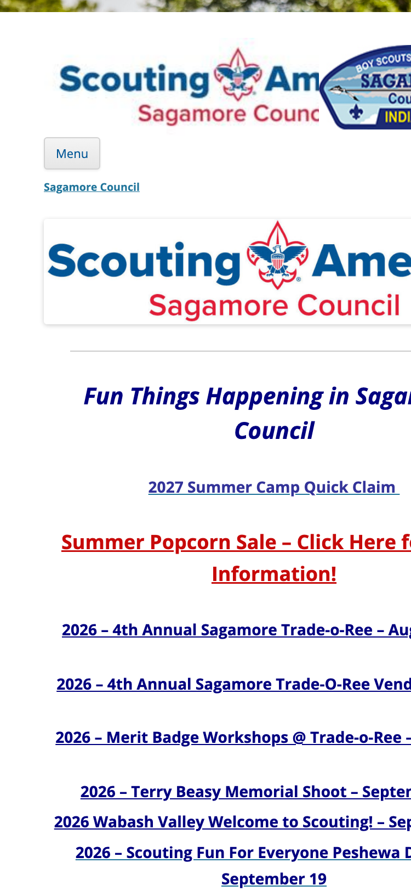

*The homepage at phone width, captured 7 August. Below the header: a menu button, then "Fun Things
Happening in Sagamore Council" and a list of event links. No route to joining, and no cost.*

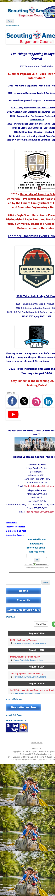

*The same page, full length. This is where the Donate button lives: 4,384 pixels down a 5,599-pixel
page, about five and a half phone screens from the top.*

One measurement worth sitting with: **at phone width, the word "join" appears nowhere on the homepage
until a parent taps the Menu button.** The word is in the page, but the navigation is hidden below 600
pixels, so the visible homepage offers a popcorn sale, a Trade-o-Ree and a merit badge workshop and no
route in. Tapping Menu brings it back. The Donate button is present but sits **4,384 pixels down a
5,599-pixel page, 78% of the way to the bottom**, about five and a half screens.

Neither of your two goals, raising money and getting new kids, has a visible path on the device your
priority audience uses. Most of what follows is small, and several of the fixes take ten minutes.

---

## The three we would do first

### 1. Your join page's content is a picture, so nothing can read it

The main content of `/join/` is a single 768 × 1024 image file (`Cub-Scouts-Rocks.jpg`) with **no alt
text**. Everything written on that flyer (the invitation, the details, the reasons to sign up) exists
only as pixels.

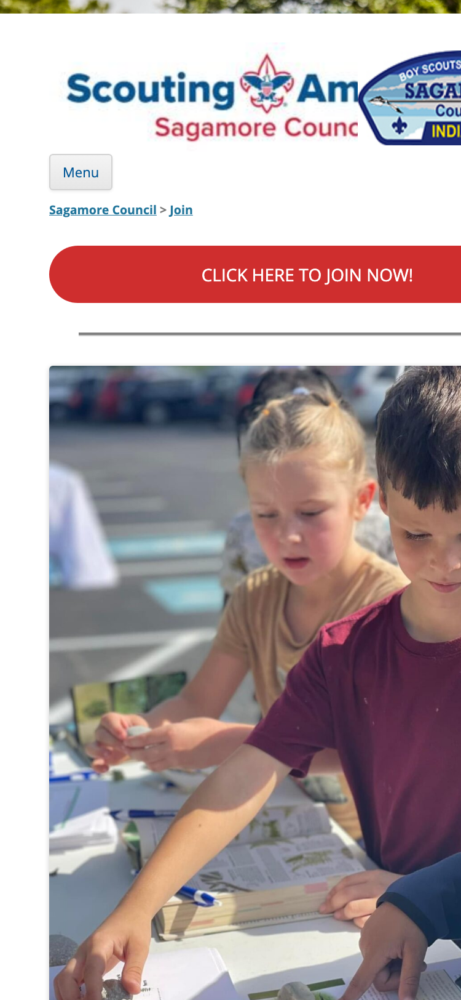

*Your join page at phone width, captured 7 August. The "CLICK HERE TO JOIN NOW!" button is well placed
and above the fold. Everything below it is the image file. As far as Google and a screen reader are
concerned, that space is empty.*

This is the actual markup on the page:

```html

```

That has two consequences. **Google cannot read a word of it**, which is a large part of why the best
page on your site does not pull its weight in search. And **a parent using a screen reader gets nothing
at all**: both images on the page carry `alt=""`, so the page is effectively blank to them.

The fix is not to remove the flyer. It is to type the flyer's words onto the page as ordinary text
underneath it, and to describe the image in its alt text.

**About 20 minutes, and it makes an existing good page work for the first time.**

### 2. Your best page has nothing linking to it

The page at `/join/` is the strongest thing on the site. A clear join button above the fold, a real
photograph of real children that visibly includes a girl, a den-by-grade breakdown, and the line
"Scouting is for the whole family! Boys, girls, moms, dads, step-parents, grandparents."

**Nothing on the site links to it.** Not the navigation, not the mobile menu, not your own sitemap page.
The "Join Scouting" menu item skips it and sends people to the national site instead, which means you
never find out who was interested and cannot follow up with anyone who hesitated.

Its "New Parents, Click HERE" link also has a stray prefix in it, which happens when a URL gets copied
out of a PDF viewer. The full address currently reads:

```
http://chrome-extension://efaidnbmnnnibpcajpcglclefindmkaj/https://scoutingevent.com/.../Parent_Guide_2022.pdf
```

That link is dead for every visitor. The fix is deleting the first 52 characters.

Clicking it produces a browser error, because "chrome-extension" is not a website and never was. The
prefix belongs to a PDF reader extension and was carried along when the address was copied.

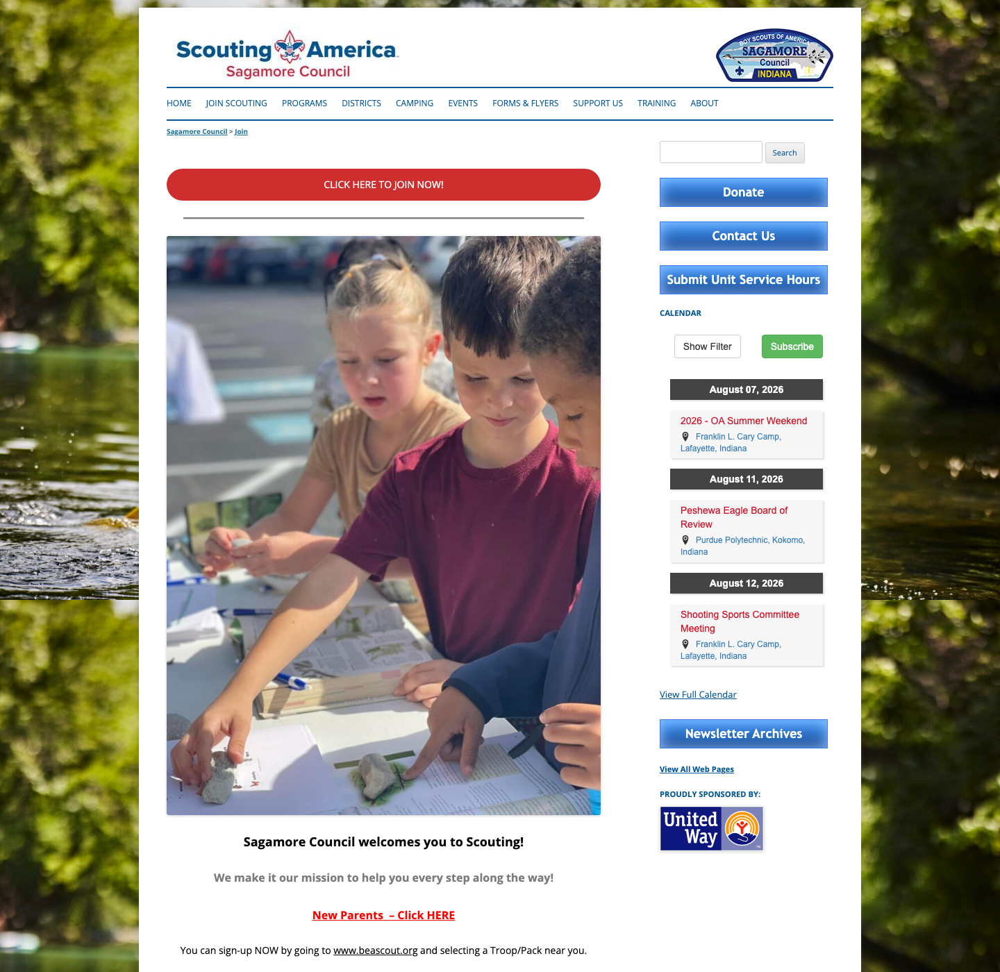

*The join page on a computer, captured 7 August. The button is well above the fold, the photograph shows
real children including a girl at the front, and the copy welcomes the whole family. This is the best
page you have, and nothing on the site links to it.*

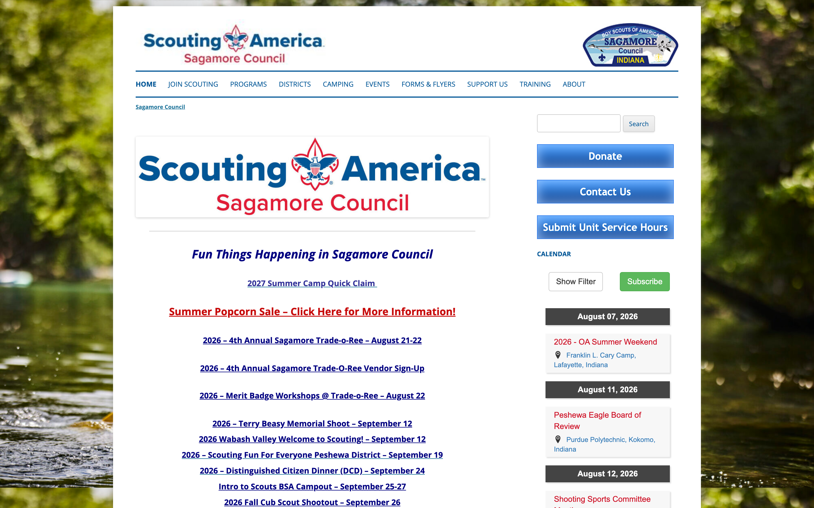

*And this is the homepage on the same screen. Compare the two: Donate is visible top-right here, and the
navigation offers "JOIN SCOUTING", but that menu item leaves for the national site rather than going to
the page above.*

**Pointing the menu at your own join page, plus that link fix, is about 15 minutes and is probably the
highest-value quarter hour available on the site.**

### 3. The cost of joining is not on the site, and the only price shown is the wrong one

We looked at every dollar figure on all 34 pages. The membership fee appears on none of them.

What a parent does find on the Cub Scouts page is **"$225 early bird price runs until June 1st / $250
normal price after June 2nd"** for an optional day camp. A parent reading that page concludes Cub Scouts
costs $225 to $250.

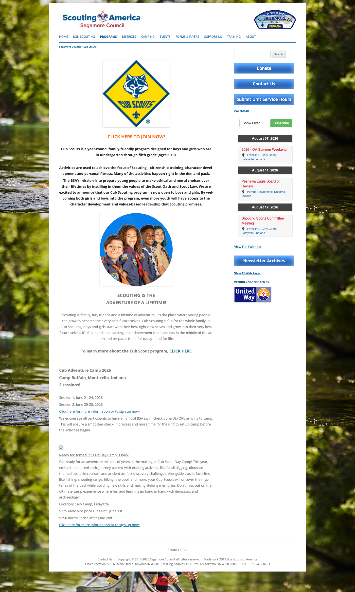

*The Cub Scouts page, captured 7 August. These are the only two dollar figures anywhere on the site, and
they are for an optional summer camp, but they are the only price a prospective parent will ever meet.*

Cost is usually the first question a parent asks, and right now the site either does not answer it or
answers it with a number several times too high. For comparison, Atlanta Area Council states that pack
dues "typically range from $40 to $85 annually, and more depending on the level of adventure activities."
Simon Kenton Council lists the national fee and the council fee as separate line items.

**This is the one finding that shows up in all three places we looked, and it is worth seeing together:**

- The price is on **none** of your 34 web pages.
- You do not appear at all on **"how much does scouting cost,"** where four peer councils do.
- Your **6 August Facebook post about the membership fee update drew 19 comments**, several of them
  parents asking plainly what the fee is and how renewal works, **and none of them has an answer.**

Parents cannot find the number on the site, cannot find it in search, so they ask you in public and hear
nothing back. One page ends all three, and answering those comments takes about ten minutes today.

**One page, "What Scouting Costs in Sagamore Council," plus a line on the Cub Scouts page clarifying
that $225 is an optional camp. Most of the hour is confirming the current council fee internally.**

---

## Branding

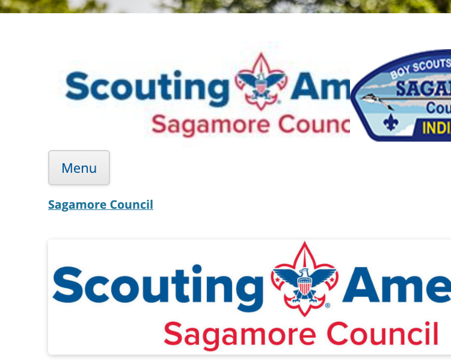

*The header at phone width. The patch image overlaps the wordmark and cuts it off mid-word.*

At phone width the council patch image **crowds the "Scouting America / Sagamore Council" wordmark** and
is itself cut off by the edge of the screen. To be precise about what this is and is not: the largest
text in the header is **"Scouting America"**, with "Sagamore Council" in red beneath it, and "BOY SCOUTS
OF AMERICA" appears only as small curved text around the patch. The header is not shouting the old name
at parents. It is simply untidy on the device most of them use.

The renaming issue is real, but it lives elsewhere: the main logo's alt text still reads **"Boy Scouts of
America,"** which is exactly what Google and screen readers see; all 28 content pages carry "Trademark
2013 Boy Scouts of America" in the footer; the Google Business Profile still lists the organization as
"Sagamore Council - Boy Scouts of America"; and your X/Twitter account still uses the old round BSA
avatar.


*The homepage end to end. The footer at the bottom carries "Trademark 2013 Boy Scouts of America", and
it appears on all 28 content pages, so this is one edit in one template rather than 28 separate jobs.*

Scouting America's own *Digital Renaming Guidance* asks that council websites be updated no later than
**February 8, 2025**, and that new domains not contain "bsa."

Since girls are roughly a fifth to a quarter of new members, this is worth more than tidiness. One of
your own Google reviews reads, in part, "My daughter is a scout. Now I'm a den leader."

**The alt text, the footer line and the Google Business Profile name are about 15 minutes between them.
The header overlap on mobile needs someone comfortable in the site theme.**

---

## Pages still advertising things that already happened


*The Buffalo Stampede page, captured 4 August 2026. The 2025 event dates and the 2025 registration
deadline sit directly beside the site's own calendar showing August 2026.*

- **Buffalo Stampede**, a top-level menu item and your main public-facing community event, is entirely
  the 2025 edition. "Next event: Saturday, October 25, 2025," with 2025 registration deadlines. A cyclist
  who lands on it this month will reasonably conclude the ride is no longer running.
- **Cub Scouts** advertises Cub Adventure Camp sessions from June 2026, now about six weeks past, on the
  most important page for new families.
- **Friends of Scouting**, your main donor page, promotes **AmazonSmile**, which Amazon shut down in
  February 2023. The section ends "Click on the link below," and there is nothing below it.
- **Recharter** describes a "NEW PROCESS... beginning March 1, 2024" two and a half years on.
- **Contact Us** lists a North Star District Executive your own Facebook page replaced this week.

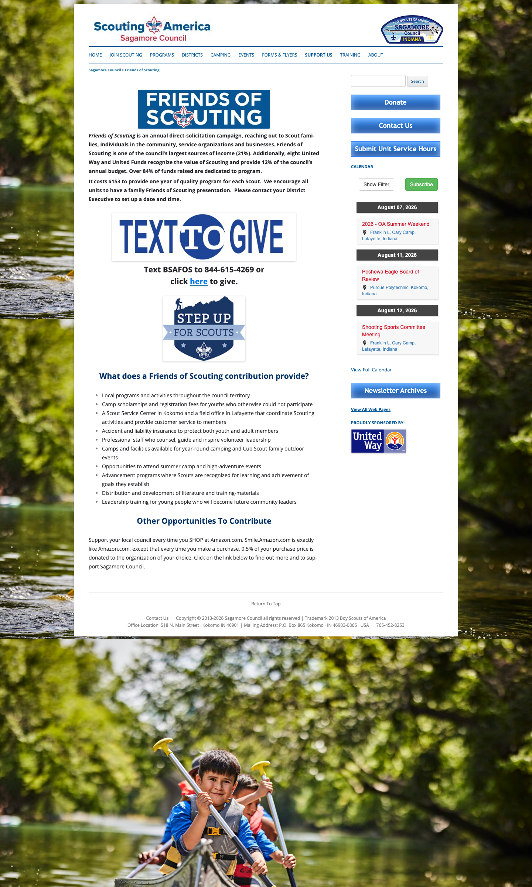

*Your Friends of Scouting page, captured 7 August. The AmazonSmile section is still here, and it still
ends "Click on the link below" with nothing below it. Amazon shut the programme down in February 2023.*

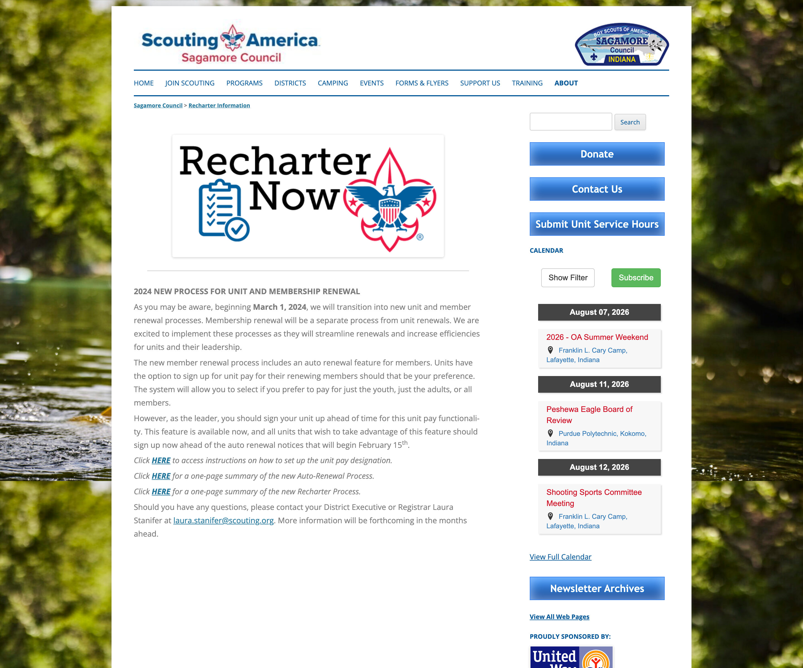

*The Recharter page, still describing a "NEW PROCESS" beginning March 1, 2024.*

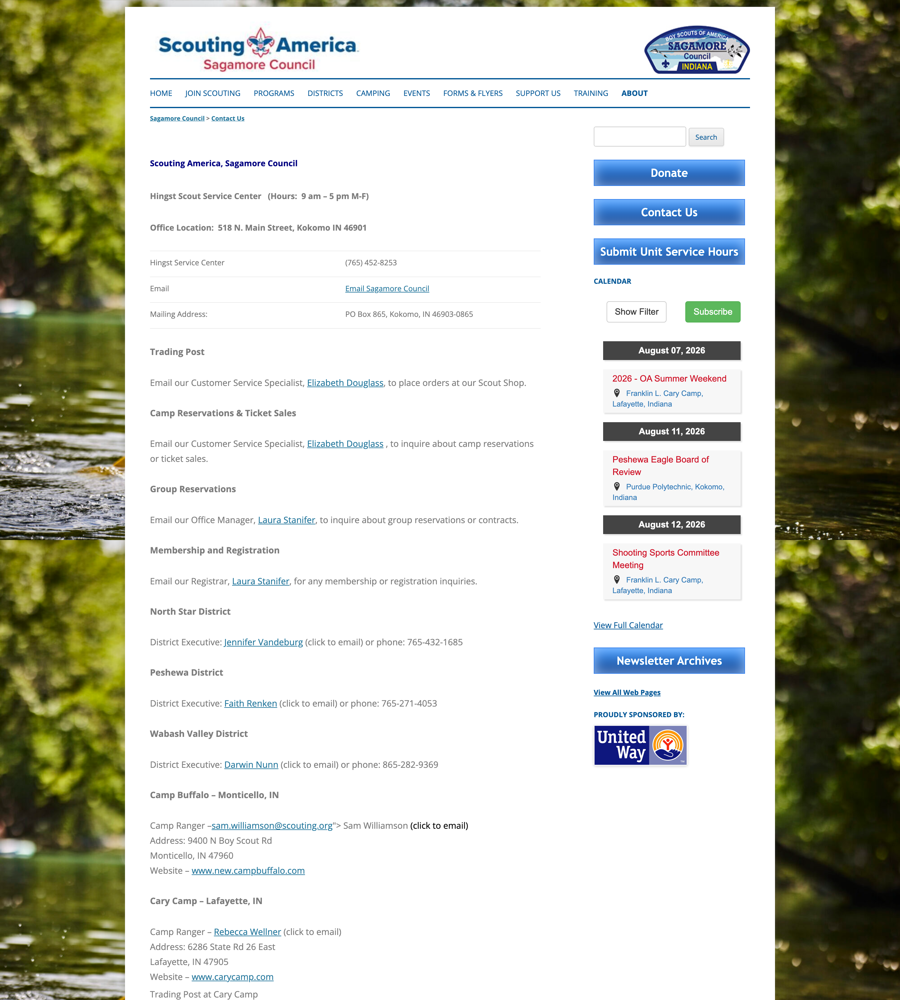

*Contact Us, still listing the North Star District Executive your own Facebook page replaced this week,
and the Camp Ranger line below, which renders as visible broken code with a staff email exposed in plain
text.*

**About 30 to 40 minutes total, and it splits neatly into four separate ten-minute jobs.**

---

## Being found on Google

The site currently gives search engines very little to work with. We crawled 41 pages: **40 of them have
no meta description**, so Google is writing your search snippets for you. There are no Open Graph tags,
which is why links you post to Facebook appear as bare URLs with no image or description. No page title
contains Kokomo, Lafayette, Logansport or Indiana. One of the two sitemaps is empty; the other was
generated in May 2014. And **31 of the 41 pages still contain `http://` links**, which browsers
increasingly flag.

The single hardest number from that crawl: **not one of the 41 pages links to your join page.**

We re-ran these searches properly on 7 August, and the news is better than our first pass suggested.
**You rank well on your own name and on your programs:**

| Search | Where you appear |
|---|---|
| sagamore council | Homepage, **#1** |
| sagamore council join | Your `/join/` page, **#1** |
| boy scouts lafayette indiana | Your `/join/` page, **#2** |
| cub scouts lafayette indiana | Your Cub Scouts page, **#1** |
| **how much does scouting cost** | **You do not appear at all** |

So a parent who already knows your name finds you immediately. **The gap is the question a parent
actually asks first.** On cost searches you are invisible, while Capitol Area, W.D. Boyce, Greater Los
Angeles and Atlanta Area councils all rank, because each of them has published a page that answers it.

This connects directly to the finding below: the cost page you do not have is also the search result you
do not have. One page fixes both.

*(No screenshots for this section, deliberately. Search engines serve automated browsers a challenge page
instead of results, and the machine we captured from geolocates outside Indiana, which would skew any
local result anyway. These positions were read by hand. They are worth thirty seconds of your own
re-checking, from your own computer, before you act on them.)*

**Adding city names to three page titles is about 15 minutes and is the single biggest search improvement
available.** Meta descriptions for the same three pages, another 20.

---

## Smaller items

- **Button contrast.** Donate, Contact Us, Submit Unit Service Hours and Newsletter Archives all use
  white text on mid-blue at a contrast ratio of 3.1 to 1. The accessibility standard for text that size
  is 4.5 to 1. Legible in good light, hard in sunlight or for anyone with reduced vision, which matters
  for parents reading on a phone outdoors. Darkening the blue fixes all four at once, about 20 minutes.


- **Mobile menu.** The menu control is built as a heading rather than a button, so it cannot be opened
  with a keyboard at all. Homepage event links are 19 pixels tall, below Apple's and Google's guidance
  for tap targets.
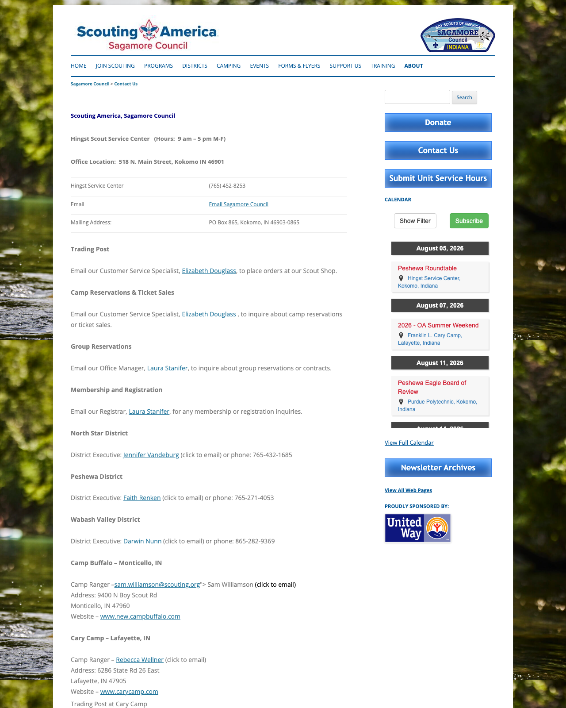

*The Camp Ranger line on the Contact page, with stray code visible and the email address exposed in plain
text. The line directly beneath it renders correctly.*

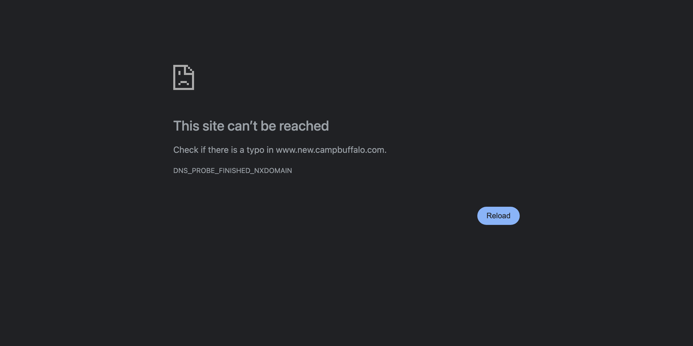

*The Camp Buffalo link. `www.new.campbuffalo.com` has no DNS record at all. `campbuffalo.com` without
the "new." loads fine, so this is a five-character fix.*

- **A few broken links.** `www.new.campbuffalo.com` has no DNS record, so dropping "new." fixes it. On
  Contact Us, the Camp Ranger line renders as visible broken code and exposes a staff email in plain
  text; the same pattern appears on ten pages. One district executive phone number uses a Tennessee area
  code and may be a typo. About 30 minutes for all of these.
- **Images.** We crawled 41 pages: **166 of 248 images carry no alt text, two thirds of them.** The homepage contains no photographs of young people at
  all: every image is a logo, an icon or an event graphic. The Scouts BSA page's only real photograph is
  from 2012. The University of Scouting graphic has its date, venue and sponsors baked into the image, so
  none of that text is searchable or readable by a screen reader.

---

## What we would not spend time on

- **Site speed.** The homepage is 92KB and loads in under half a second. It is genuinely fine.
- **Moving off the `/htdocs/wordpress/` URLs.** There is a real search benefit in cleaner addresses, but
  it needs hosting changes and a full redirect map, and a partial migration would leave you worse off
  than today. Not worth it against the other items on this list.
- **The domain change off sagamorebsa.org.** Expected eventually, but it is a project rather than a task.

---

## Where to start

**Under ten minutes each, and they can be done in any order:**

| | Minutes |
|---|---|
| Answer the 19 unanswered comments on the 6 August membership fee post | 10 |
| Point the "Join Scouting" menu item at your own `/join/` page | 10 |
| Remove the `chrome-extension//` prefix from the New Parents link | 5 |
| Add alt text to the two images on `/join/` | 5 |
| Update the two `http://www.beascout.org` links to `https://beascout.scouting.org/` (they redirect and work today, but the old address is unencrypted) | 10 |
| Change the logo alt text | 2 |
| Update the footer trademark line | 5 |
| Delete the AmazonSmile paragraph | 5 |
| Remove the past camp dates from the Cub Scouts page | 10 |
| Add "2026 dates coming soon" to Buffalo Stampede | 10 |
| Fix `new.campbuffalo.com` | 3 |
| Repair the Camp Ranger line on Contact Us | 10 |
| Update the North Star District Executive | 5 |
| Rename the Google Business Profile | 5 |
| Repoint the Google Business Profile website link | 5 |
| Add city names to three page titles | 15 |
| Write three meta descriptions | 20 |

**A few hours, no outside help needed:** the "What Scouting Costs" page · adding cost, meeting cadence
and district towns to the join page · rebuilding the top of the homepage around joining, using the
photograph already on the join page · alt text · an SEO plugin for Open Graph tags · fixing the sitemaps ·
darkening the buttons.

**Worth asking a volunteer for:** the mobile header overlap and the mobile menu are theme-level work. A
Scouting parent who does web work is a realistic route, as an in-kind contribution rather than a budget
line.

---

## Two things worth checking that we could not

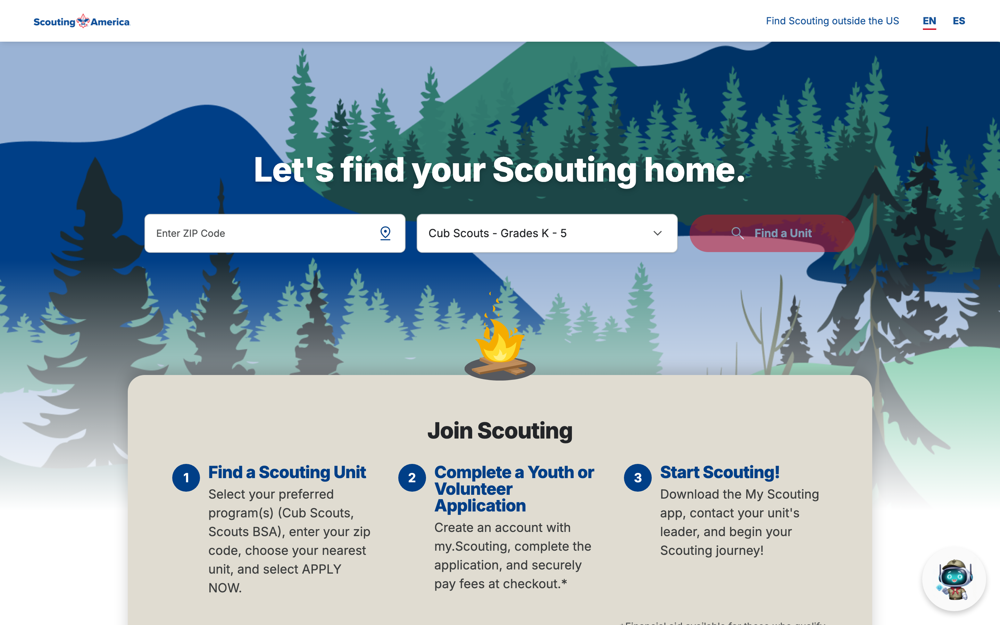

*Where your "CLICK HERE TO JOIN NOW!" button lands, captured 7 August. It works: the old `beascout.org`
address redirects correctly to the current one. An earlier draft of this review reported it as broken;
that was our testing tool being blocked, not your link, and we have removed the claim.*

**The BeAScout unit search.** We did not submit a ZIP search, so we do not know whether packs actually
appear for Kokomo, Lafayette and Logansport, or whether the pins, meeting times and contacts are current.
**This is worth ten minutes of your time before anything else on this list**, because every fix above
hands a parent to that search. If the results are thin or stale, that becomes the first priority.

**Google Search Console.** How many of your pages Google has actually indexed is visible from the account
you already have, and we could not see it from outside.

---

## One asset worth knowing about

Your Google Business Profile carries **4.6 stars across 18 reviews**, with a correct address, hours,
phone and category. The only two defects are the organization name and the website link, both five-minute
fixes. Nothing else on this list buys that much credibility that cheaply.

*(No screenshot here, for the same reason as the search section: Google serves automated browsers a
challenge page rather than results. This was read by hand and takes you ten seconds to confirm: it is
the panel on the right when you search your own council name.)*

---

## A note on the evidence in this document

Almost every claim above has a screenshot under it, captured on 7 August. Three do not, and it is worth
saying why rather than leaving you to wonder:

- **Search positions and the Google Business Profile.** Search engines show automated browsers a
  challenge page instead of results, and the machine we captured from is not in Indiana, so local results
  would be wrong even if it passed. Read by hand, stated as such, and worth thirty seconds of your own
  checking.
- **The alt-text count (39 of 44 images) and the mobile menu being built as a heading.** These live in the
  page's code rather than on the screen. A screenshot would show you a normal-looking page, which is
  precisely the problem: the defect is invisible to a sighted mouse user and total for everyone else.
